# FlexBox 속성

## 📌 Flexbox 속성 목록

| 구분                         | 속성                                                                                                            |
| ---------------------------- | --------------------------------------------------------------------------------------------------------------- |
| **Flex Container 관련 속성** | `display` <br> `flex-direction` <br> `flex-wrap` <br> `justify-content` <br> `align-items` <br> `align-content` |
| **Flex Item 관련 속성**      | `align-self` <br> `flex-grow` <br> `flex-basis` <br> `order`                                                    |


### 1. Flex Container 지정
- display 속성을 flex로 설정하면 Flex Container로 지정됨
- flex item은 기본적으로 행(주 축의 기본값인 가로 방향)으로 나열
- flex item은 주 축의 시작선에서 시작
- flex item은 교차축의 크기를 채우기 위해 늘어남

- Before

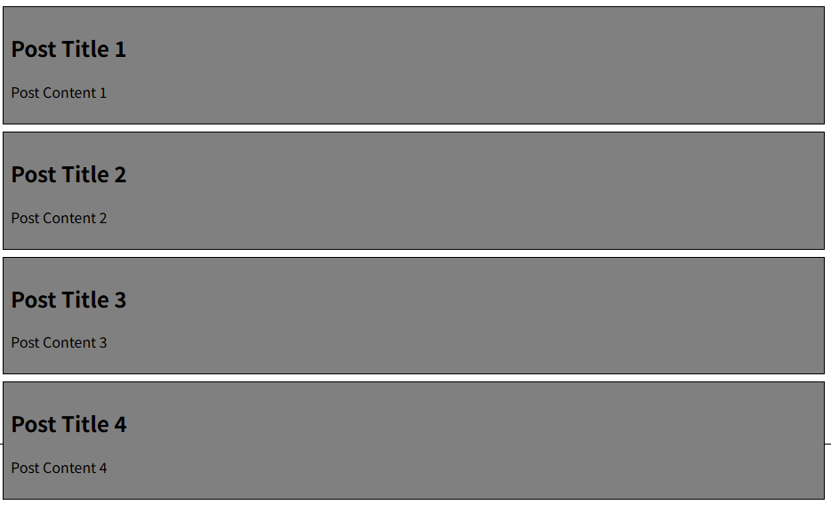

- After

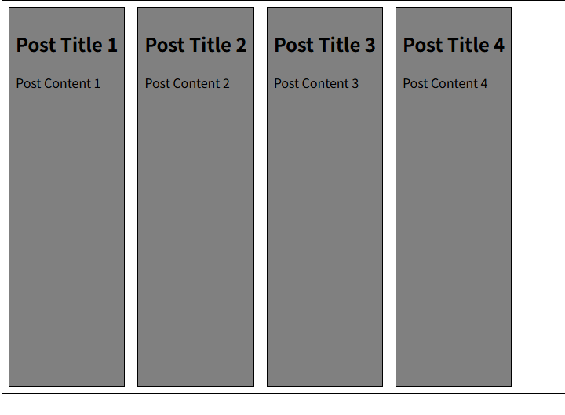

```css
.container {
      height: 500px;
      border: 1px solid black;
      display: flex;
}
```

### 2. flex-direction
- flex item이 **나열되는 방향을 지정**
- 속성
  - row(기본값): 아이템을 가로 방향으로 좌->우 배치
  - column: 아이템을 세로 방향으로 상->하 배치
  - '-reverse'로 지정하면 flex item 배치의 시작선과 끝선이 서로 바뀜
- before


```css
    .container {
      height: 500px;
      border: 1px solid black;
      display: flex;
      /* flex-direction: row; */
      flex-direction: column;
      /* flex-direction: row-reverse; */
      /* flex-direction: column-reverse; */
    }
```
- `flex-direction: row-reverse;`
- 
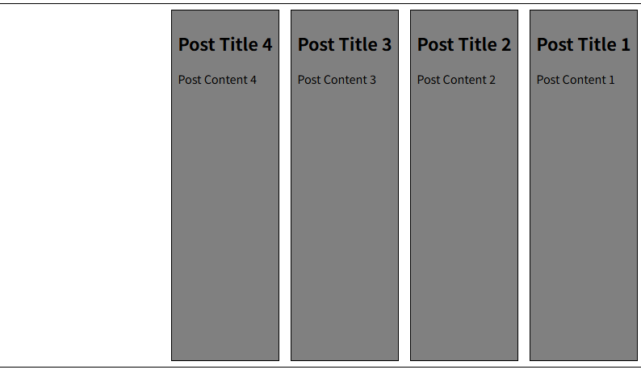

- `flex-direction: column;`

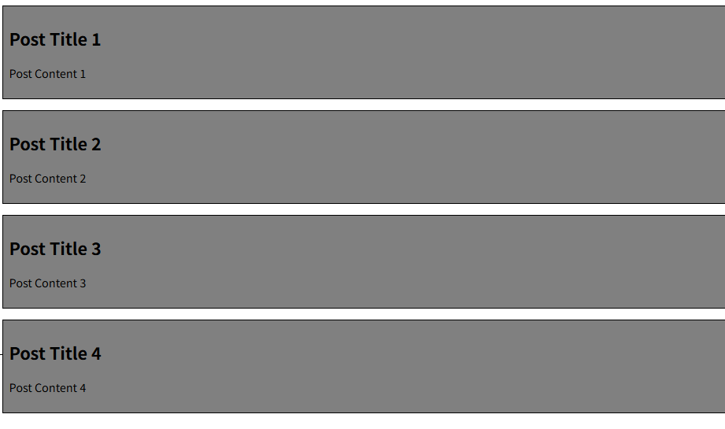

- `flex-direction: column-reverse;`

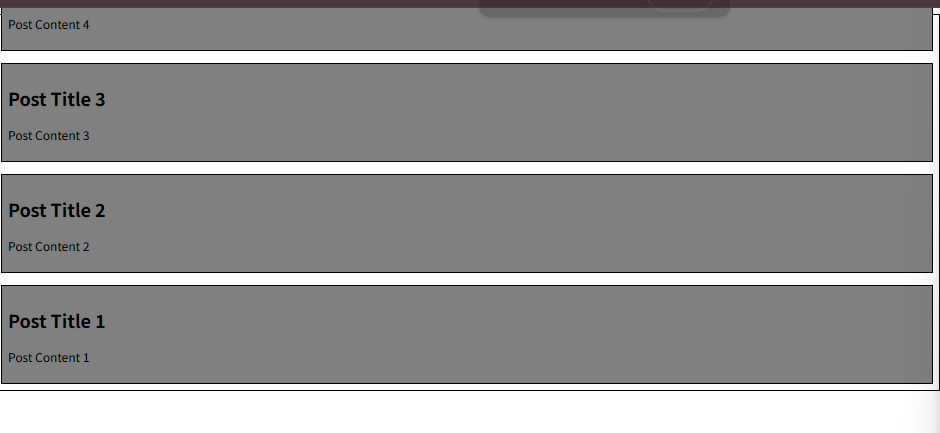


### 3. flex-wrap
- flex item 목록이 flex container의 한 행에 들어가지 않을 경우 **다른 행에 배치할지 여부 설정**
- 속성
  - nowrap(기본값) : 줄 바꿈을 하지 않음
  - wrap : 여러 줄에 걸쳐 배치될 수 있게 설정
  
```css
.contaibner {
  /* flex-wrap: nowrap; */
  flex-wrap:wrap;
}
```
- before 
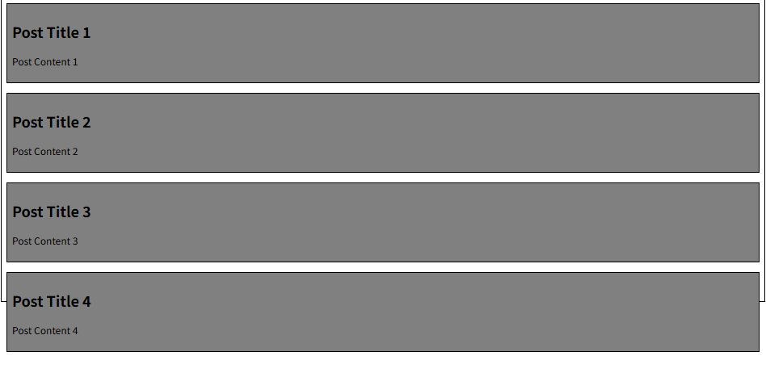

- wrap
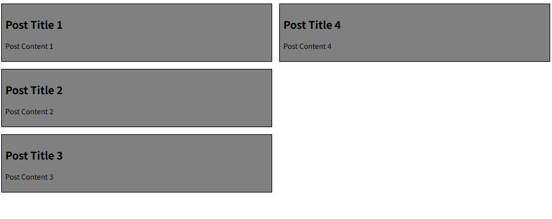

- nowrap
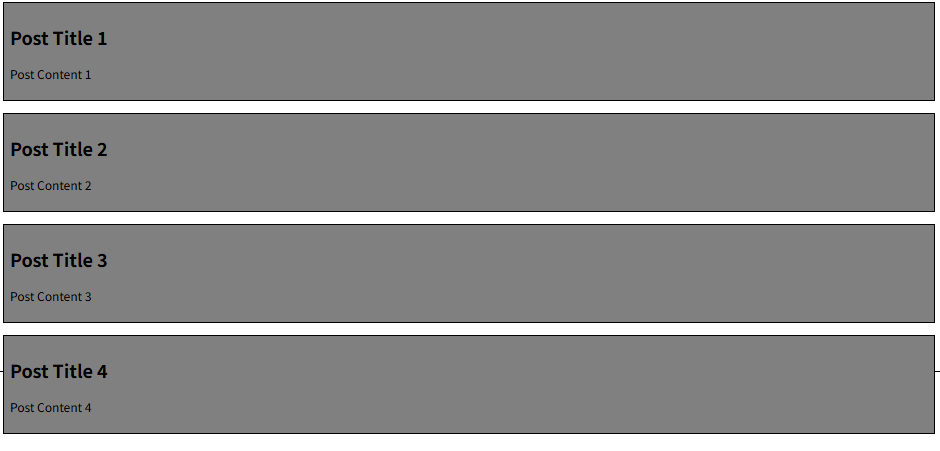


### 4. justify-content
- 주 축을 따라 flex item 들을 정렬하고 간격을 조정
- 속성
  - flex-start(기본값): 주 축의 시작점으로 정렬
  - center : 주 축의 중앙으로 정렬
  - flex-end : 주 축의 끝점으로 정렬
  
- CSS

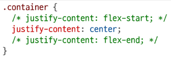

- before
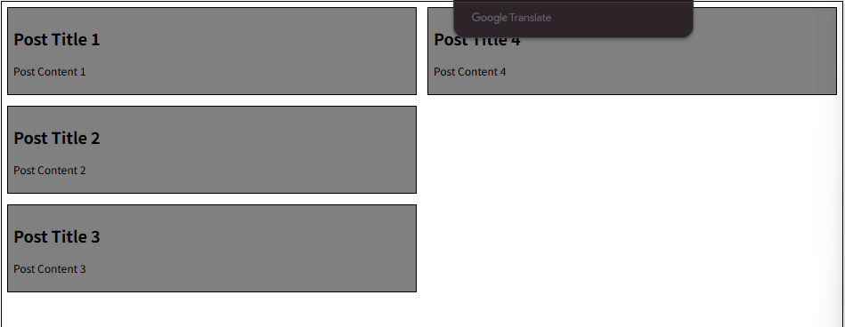

- center
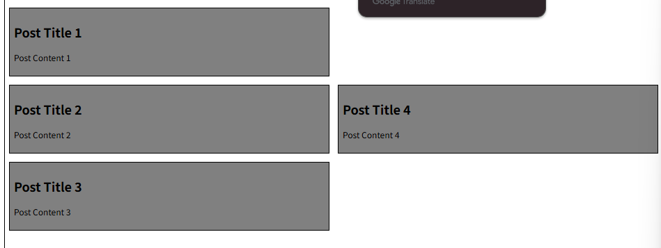

- flex-end
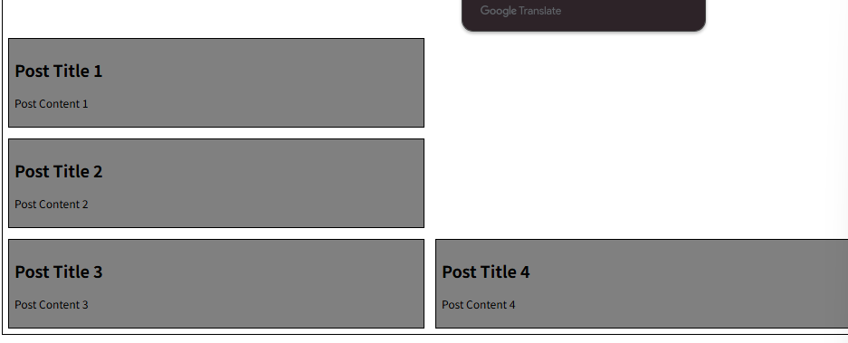
  
### 5. align-content
- 컨테이너에 여러 줄의 flex item이 있을때 그 줄들 사이의 공간을 어떻게 분배할지 지정
  - flex-wrap이 wrap 또는 wrap-reverse로 설정된 여러 행에만 적용됨
  - flex item이 2줄 이상일 때만 의미가 있음(flex-wrap이 nowrap으로 설정된 경우)
  
- 속성
  - stretch(default) : 여러 줄을 교차 축에 맞게 늘려 빈 공간을 채움
  - center : 여러 줄을 교차축의 중앙에 맞게 정렬
  - flex-start : 여러 줄을 교차축의 시작점(보통 위쪽)에 맞게 정렬
  - flex-end : 여러 줄을 교차축의 끝점(보통 아래쪽)에 맞게 정렬
  
  ```css

  ```