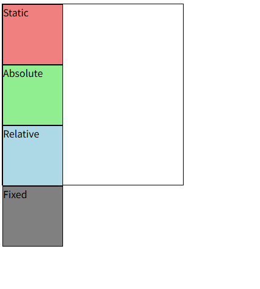
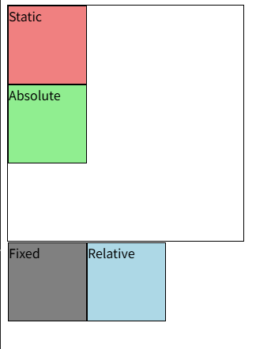
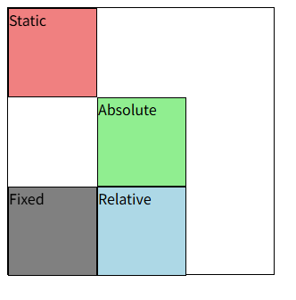
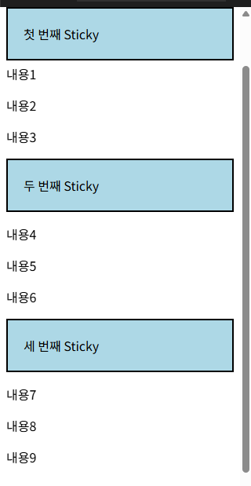
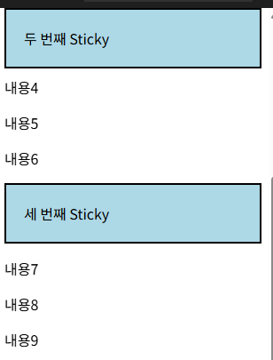
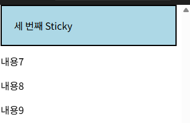

# position 유형

### **예시 default html & css**
```html
<body>
  <div class="container">
    <div class="box static">Static</div>
    <div class="box absolute">Absolute</div>
    <div class="box relative">Relative</div>
    <div class="box fixed">Fixed</div>
  </div>
</body>
```

```css
* {
      box-sizing: border-box;
    }

    body {
      height: 1500px;
    }

    .container {
      position: relative;
      height: 300px;
      width: 300px;
      border: 1px solid black;
    }

    .box {
      height: 100px;
      width: 100px;
      border: 1px solid black;
    }
```

## static
- 요소 normal flow 따라 배치
- 상하좌우 속성 적용 X
- default
```css
.static {
  position: static;
  background-color: lightcoral;
}
```

### 예시




## relative (상대 위치)
- 원래 있던 자리(Normal Flow)를 기준으로 이동
- 공간은 그대로 유지되며, 시각적으로만 위치가 옮겨짐
- 예) 원래 위치에서 `top: 10px` → 아래로 10px 이동

```css
.relative {
  position: relative;
  background-color: lightblue;
  top: 100px;
  left: 100px;
}
```

### 예시



## absolute (절대 위치)
- 부모(조상) 중 `position`이 설정된 요소를 기준으로 위치 결정
- Normal Flow에서 빠져나와 다른 요소와 겹칠 수 있음
- 예) 부모 박스 기준 오른쪽 위 고정

```css
.absolute {
  position: absolute;
  background-color: lightblue;
  top: 100px;
  left: 100px;
}
```




## fixed (고정 위치)
- 브라우저 **화면(Viewport)**을 기준으로 고정
- 스크롤을 내려도 항상 같은 위치에 표시
- 예) 화면 하단에 고정된 네비게이션 바

  ```css
  .absolute {
    position: fixed;
    background-color: gray;
    top: 0;
    left: 0;
  }
  ```

### 예시


## sticky (혼합형)
- 스크롤 위치에 따라 **relative → fixed**처럼 동작
- 일정 지점 전까지는 `relative`, 임계점 지나면 `fixed`처럼 붙음
- 예) 스크롤하다 보면 상단에 달라붙는 헤더








### position absolute 활용

* **개념**
  - `absolute`는 요소를 **Normal Flow(일반 문서 흐름)**에서 제거하고, 
    가장 가까운 `position`이 지정된 조상(`relative`, `absolute`, `fixed`, `sticky`)을 기준으로 배치됨.
  - 기준이 되는 조상이 없다면, **문서 전체(브라우저 body 기준)**의 좌상단을 기준으로 함.

---

* **대표 패턴: 부모 relative + 자식 absolute**
  - 부모 박스를 `position: relative`로 설정 → 부모가 기준점이 됨.
  - 자식 요소를 `absolute`로 두면 부모 박스 안에서 원하는 위치(top/right/left/bottom) 지정 가능.

```html
<div class="card">
  <button class="badge">NEW</button>
</div>
```

```css
.card {
  position: relative;   /* 기준점이 됨 */
  width: 200px;
  height: 100px;
  border: 1px solid black;
}

.badge {
  position: absolute;
  top: 8px;
  right: 8px;           /* card의 안쪽 우측 상단 기준 */
  background: red;
  color: white;
  padding: 4px 6px;
}
```

---

* **활용 포인트**

  * `.card`가 **기준 프레임**, `.badge`는 **그 안에서 정확히 배치**됨.
  * 버튼, 배지, 알림 표시, 오버레이 같은 **요소를 박스 내부 특정 위치에 고정**시킬 때 많이 사용.

---

* **자주 하는 실수**

  1. **부모에 position을 주지 않음**
     → 자식이 페이지 전체의 좌상단 기준으로 달라붙어버림.
  2. **margin으로 위치 조정**
     → 브라우저 크기/콘텐츠 변경 시 깨지기 쉬움.
     → 반드시 `top`, `left`, `right`, `bottom` 속성으로 조정할 것.
  3. **z-index 누락**
     → 겹치는 요소가 위/아래로 잘못 보일 수 있음.
     필요하면 `z-index`로 쌓임 순서 조정.

---

* **실무 활용 예**

  * 카드 위 "NEW" 배지
  * 이미지 우상단 닫기(X) 버튼
  * 지도 위 마커, 툴팁
  * 모달 내부 닫기 버튼


### z-index

* **개념**
  - `z-index`는 요소의 **쌓임 순서(Z축)**를 정의하는 속성
  - 마치 졸라맨이 위에서 무대를 내려다볼 때,  
    배우가 배경보다 앞에 보이는 것처럼 **숫자가 큰 요소가 위에 올라옴**

---

* **특징**
  - 정수 값을 사용하여 Z축 순서를 지정
  - 값이 클수록 요소가 위로 쌓임
  - `position`이 `static`(기본값)이 아닌 요소에서만 적용됨
  - 기본값은 `auto` → 부모의 z-index 영향을 받음
  - 같은 부모 안에서는 z-index 값끼리 비교, 값이 같으면 HTML 문서 순서대로 쌓임
  - 부모의 z-index가 낮으면, 자식의 z-index가 아무리 커도 부모보다 위로는 올라갈 수 없음

> [!TIP]  
> - `position` 속성이 `static`이 아닌 요소에만 z-index가 적용됩니다.  
> - 음수 z-index 값은 요소를 부모 요소의 뒤(배경)로 보낼 때사용할 수 있습니다.

---

* **예시 코드**

```html
<div class="container">
  <div class="box red"></div>
  <div class="box green"></div>
  <div class="box blue"></div>
</div>
```

```css
.container {
  position: relative;
}
.box {
  position: absolute;
  width: 100px;
  height: 100px;
}

.red {
  background-color: red;
  top: 50px; left: 50px;
  z-index: 3;   /* 가장 위 */
}
.green {
  background-color: green;
  top: 100px; left: 100px;
  z-index: 2;   /* 중간 */
}
.blue {
  background-color: blue;
  top: 150px; left: 150px;
  z-index: 1;   /* 가장 아래 */
}
```

---

* **시각적 결과**

  * 빨간 박스(`z-index: 3`)가 제일 위
  * 그 아래에 초록(`z-index: 2`)
  * 제일 밑에 파랑(`z-index: 1`)


