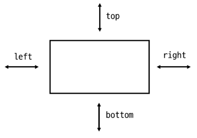

# 📌 CSS Layout & Position

## 🔹 CSS Layout
- 각 요소의 **위치와 크기를 조정**하여 웹 페이지의 디자인을 결정
- 요소들을 상하좌우로 정렬하고, 간격을 맞추어 전체 페이지의 뼈대를 구성
- **핵심 속성**: `display`  
  - `block`, `inline`, `flex`, `grid`, ...

---

## 🔹 CSS Position
- 요소를 **Normal Flow**에서 제거하여 **다른 위치로 배치**
- 다른 요소 위에 올리거나, 화면 특정 위치에 고정 가능
- **핵심 속성**: `position`  
  - `static`, `relative`, `absolute`, `fixed`, `sticky`, ...

---

## 🔹 Position 이동 방향
- 네 가지 속성: `top`, `bottom`, `left`, `right`  
  → 요소의 위치를 조절할 수 있음
- 겹치는 요소는 **쌓이는 순서(z-index, Z Axis)**로 제어 가능

