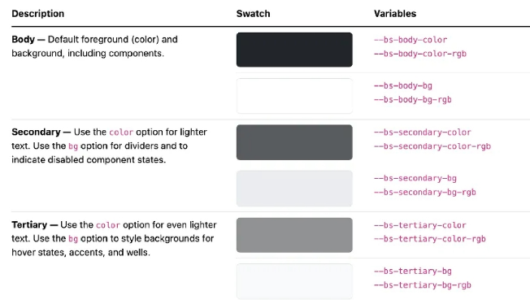
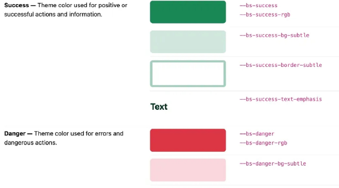
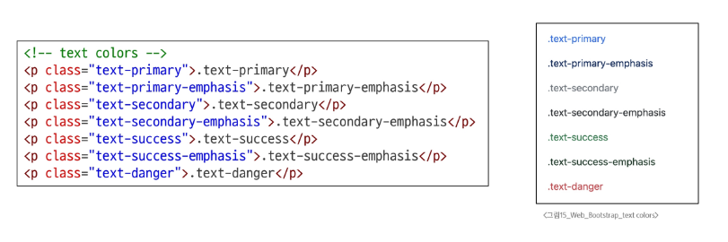

# colors

## bootstrap color system
- bootstrap이 지정하고 제공하는 색상 시스템
- 일관성 있는 의미론적 관점의 색상을 적용할 수 있게함
  - blue -> primary , red -> Danger

### colors에 관해
- Text,Border,Background 및 다양한 요소에 사용하는 bootstrap 색상 키워드

### text colors

### background colors

