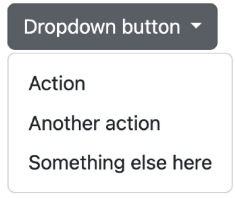
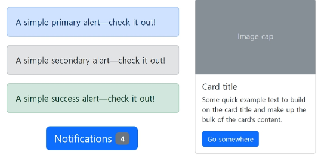
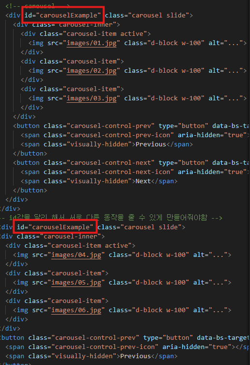
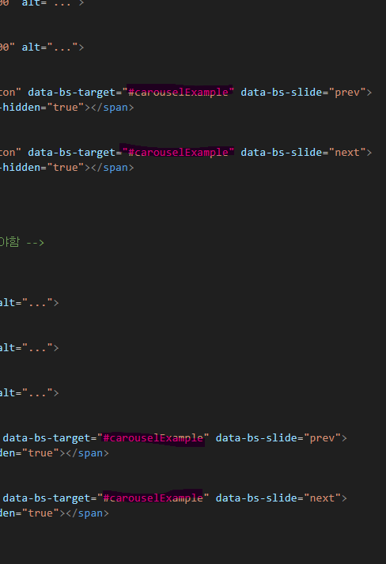
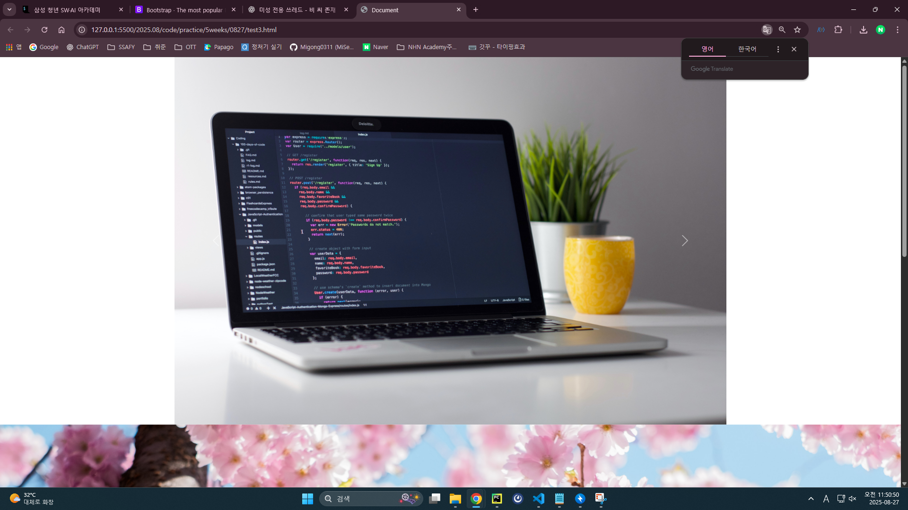

# component

- bootstrap에서 제공하는 UI 관련 요소

### 이점
- 일관된 디자인을 제공하여 웹사이트의 구성 요소를 구축하는데 유용하게 활용
- 대표 컴포넌트
  - alerts
  - badges
  - cards
  - navbar

## carousel 및 modal에 유의점

### 🖼️ Carousel (캐러셀)
- 유의점 1

- 위 사진은 케러셀의 html 예시 로직이다. 
- 여기에서 네모 박스 표시로 적힌 id값이 같음을 알 수 있다(참고로 각자 다른 케러셀임)

- 이렇게 되면 위 사진과 같이 2개의 케러셀이 나오는데 아래 케러셀 버튼을 눌리면 위에 케러셀이 움직이는 버그가 발생한다 
- 이걸 방지하기위해선 저기 맨위에 있는 사진속 표시한 변수들을 다르게 설정을해야 각기 다른 방식으로 이동이 가능하다

- 유의점 2
  - **이미지 크기**를 통일해야 슬라이드 전환 시 화면이 튀지 않음  
  - 자동 슬라이드(`data-bs-interval`)는 사용자의 접근성을 해칠 수 있어  필요 시만 사용  
  - 모바일 환경에서는 과도한 이미지 사용 시 **로딩 속도 저하** 발생 가능  
  - `alt` 속성을 반드시 넣어 **시각장애인 접근성**을 보장해야 함  
  - 화살표, 인디케이터 버튼이 잘 보이도록 색상 대비를 고려해야 함  

### 🪟 Modal (모달)
- 모달은 **중첩 사용**(modal 안에 또 다른 modal)은 가급적 피해야 함  
- 스크롤이 긴 경우 `modal-dialog-scrollable` 클래스를 활용해 **사용자 편의성** 확보  
- `aria-labelledby`, `aria-hidden` 등 **접근성 속성**을 반드시 지정  
- 백드롭(배경)이 클릭되면 닫히는 기본 동작을 제어하려면 `data-bs-backdrop="static"` 옵션 활용  
- 너무 많은 내용을 모달에 담지 말고, 간결한 메시지나 입력 폼 정도로 사용하는 것이 적절  

---
👉 Carousel은 **시각적 안정성과 접근성**, Modal은 **사용자 경험과 접근성**에 특히 주의해야 한다.
