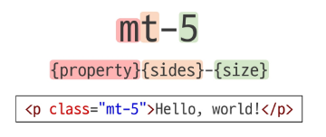

# bootstrap 이란?

- css 프론트엔드 프레임워크(tool kit)
- 미리 만들어진 다양한 디자인 요소들을 제공하여 웹사이트를 빠르고 쉽게 개발할 수 있도록 함

### CDN
- 서버와 사용자 사이의 물리적인 거릴 줄여 콘텐츠 로딩에 소요되는 시간을 최소화
  - 웹 페이지 로드 속도를 높임
- 지리적으로 사용자와 가까운 CDN 서버와 콘텐츠를 저장해서 사용자에게 전달

## 📘 Bootstrap 기본 사용법

Bootstrap에는 특정한 규칙이 있는 클래스 이름으로 스타일 및 레이아웃이 미리 작성되어 있음  

---

### ✅ Spacing을 표현하는 방법
- **property**: `margin` 또는 `padding`  
- **sides**: 방향 (`top`, `left`, `x`, `y` 등)  
- **size**: Spacing의 상대적 너비  

---

### 🔹 margin과 padding의 차이
- **margin**: 해당 요소와 다른 요소와의 **외부 간격**  
- **padding**: 해당 요소의 border와 내부 사이의 **여백**

---

### 🛠️ 클래스 사용법
```html
<p class="mt-5">Hello, world!</p>
```

* `mt-5` → **margin-top**을 크기 `5`만큼 적용
* 기본 형식:

  ```sql
  {property}{sides}-{size}
  ```



---

## 📘 Bootstrap에서 Spacing 표현 규칙

### 1. Property

| 이름 | 값       |
| -- | ------- |
| m  | margin  |
| p  | padding |

---

### 2. Sides

| 이름    | 값           |
| ----- | ----------- |
| t     | top         |
| b     | bottom      |
| s     | left        |
| e     | right       |
| y     | top, bottom |
| x     | left, right |
| blank | 4 sides     |

---

### 3. Size

| 이름   | 값(상대)    | 값(절대) |
| ---- | -------- | ----- |
| 0    | 0 rem    | 0 px  |
| 1    | 0.25 rem | 4 px  |
| 2    | 0.5 rem  | 8 px  |
| 3    | 1 rem    | 16 px |
| 4    | 1.5 rem  | 24 px |
| 5    | 3 rem    | 48 px |
| auto | auto     | auto  |

---

### ℹ️ 참고

* **rem**: 최상위 요소의 글씨 크기를 기준으로 크기가 결정되는 상대 단위


