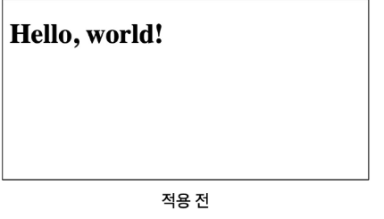
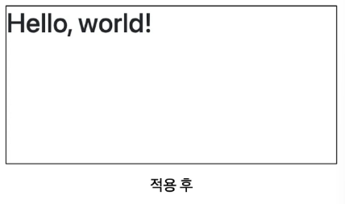
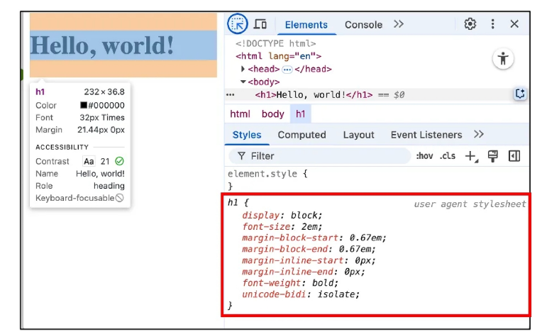

# reset CSS

### bootstrap 사용 전 & 후
- bootstrap을 HTML에 반영하면 일부 스타일이 바뀜
  - h1 요소 폰트변경
  - body와의 여백 사라짐

## reset css 의 의미
- 모든 HTML 요소 스타일을 일관된 기준으로 재설정하는 간결하고 압축된 규칙 시트
- 기본 요소들을 일관성 있게 스타일을 적용 시키는 기본 단계

## ✅ Reset CSS 사용 배경
- 모든 브라우저는 각각의 **user agent stylesheet**를 가지고 있음  
  - 웹사이트를 보다 읽기 편하게 하기 위해 기본 스타일을 적용해둔 것  
- 문제는 이 설정이 브라우저마다 상이하다는 것  
- 모든 브라우저에서 웹사이트를 동일하게 보이게 만들어야 하는 개발자에겐 매우 곤란한 일  

👉 따라서 **모두 똑같은 스타일 상태로 초기화**하고 스타일 개발을 시작하는 방식이 필요함  

---
## user-agent stylesheet
- 모든 문서에 기본 스타일을 제공하는 기본 스타일 시트

---

## ✅ Normalize CSS
- Reset CSS 방법 중 **대표적인 방법**  
- **웹 표준 기준**으로 브라우저 간 불일치가 발생하면 차이가 있는 브라우저를 수정하는 방식  

### 특징
- 경우에 따라 IE 또는 Edge 브라우저는 표준에 따라 수정할 수 없는 경우도 있음  
- 이 경우 IE 또는 Edge의 스타일을 기준으로 나머지 브라우저에 적용시킴  

---

### 📌 정리
- **Reset CSS**: 모든 브라우저의 기본 스타일을 완전히 초기화  
- **Normalize CSS**: 브라우저 간 차이를 최소화하고 웹 표준에 맞게 보정