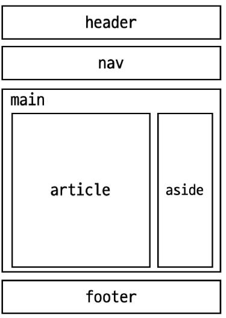

# semantic HTML

## HTML Semantic Element
- 기본적인 모양과 기능 이외의 의미를 가지는 HTML 요소

### 예시

```html
<!DOCTYPE html>
<html lang="en">

<head>
  <meta charset="UTF-8">
  <meta name="viewport" content="width=device-width, initial-scale=1.0">
  <title>Document</title>
</head>

<body>
  <header>
    <h1>Header</h1>
  </header>

  <nav>
    <ul>
      <li><a href="#">Home</a></li>
      <li><a href="#">About Us</a></li>
      <li><a href="#">Contact</a></li>
    </ul>
  </nav>

  <main>
    <article>
      <h2>Article Title</h2>
      <p>Article content goes here...</p>
    </article>
    <aside>
      <h3>Aside</h3>
      <ol>
        <li><a href="#">Lorem, ipsum.</a></li>
        <li><a href="#">Lorem, ipsum.</a></li>
        <li><a href="#">Lorem, ipsum.</a></li>
      </ol>
    </aside>
  </main>

  <footer>
    <p>&copy; All rights reserved.</p>
  </footer>

</body>

</html>

```



- header
  - 소개 및 탐색에 도움을 주는 컨텐츠
- nav
  - 현재 페이지 내 또는 다른 페이지로의 링크를 보여주는 구획
- main
  - 문서의 주요 컨텐츠
- article
  - 독립적으로 구분해 배포하거나 될 수 있는 구성의 컨텐츠 구획
- section
  - 문서의 독립적인 구획
  - 더 적합한 요소가 없을 때 사용
- aside
  - 문서의 주요 내용과 간접적으로만 연관된 부분
- footer
  - 가장 가까운 조상구획(main,article 등)의 작성자, 저작권정보,관련문서