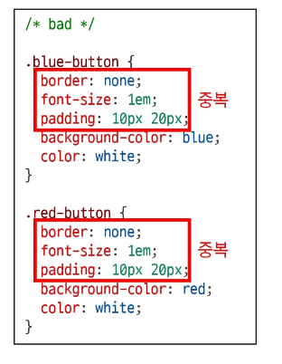
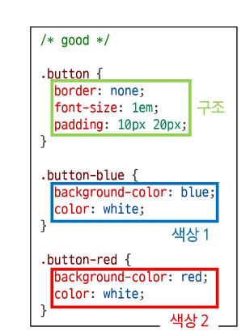

# semantic CSS


## OOCSS (객체 지향적 CSS)

### 방법론

- 1. 구조와 스킨 분리
  - 구조와 스킨을 분리함으로써 가능성을 높임

- 나쁜 예
  - 하나의 선택자에 구조와 색상(스킨)에 대한 선언이 혼재됨
  > 다른 색의 버튼을 추가할 때 구조 코드로 반복



- 좋은 예
  - 구조(.button)와 색상(.button-blue)을 나타내는 선택자가 분리
  > 다른 색의 버튼을 추가할 때 다른 선언만 추가





## 📘 OCSS 적용 예시

---

## 1. 변경 전과 변경 후

### 변경 전
- `.header`와 `.footer` 클래스가 **폰트 크기와 색상**을 동시에 담당 → 역할 혼재  

```css
/* bad */
.header h2 {
  font-size: 24px;
  color: white;
}

.footer h2 {
  font-size: 24px;
  color: black;
}
```

---

### 변경 후

* `.container .title` → 폰트 크기 담당 (콘텐츠 스타일)
* `.header`와 `.footer` → 색상 담당 (컨테이너 스타일)

```css
/* good */
.container .title {
  font-size: 24px;
}

.header {
  color: white;
}

.footer {
  color: black;
}
```

👉 **핵심**: 스타일을 기능별로 분리해 재사용성과 유지보수성을 높임

---

## 2. 컨테이너와 콘텐츠 분리 원칙

* 객체에 직접 적용하는 대신 **컨테이너에 스타일을 적용**
* 스타일 정의 시 위치에 의존적인 속성을 최소화
* 콘텐츠를 다른 컨테이너로 옮기거나 재배치해도 **스타일이 깨지지 않도록 설계**

> 💡 Bootstrap의 미디어 객체(`Utilities > Flex > Media object`)는 이 원칙을 잘 보여주는 예시

---

## 3. OCSS 적용 예시 (Card & Button)

### 예시 코드

```html
<div class="card">
  <h2 class="card-title">Card Title</h2>
  <p class="card-description">This is a card description.</p>
  <button class="btn btn-blue">Learn More</button>
  <button class="btn btn-red">Learn More</button>
</div>
```

```css
/* 기본 Card 구조 */
.card {
  border: 1px solid #ccc;
  border-radius: 4px;
  padding: 16px;
  width: 50%;
}

/* Card 제목 */
.card-title {
  font-size: 20px;
  font-weight: bold;
  margin-bottom: 8px;
}

/* Card 설명 */
.card-description {
  font-size: 16px;
  margin-bottom: 16px;
}

/* 기본 버튼 구조 */
.btn {
  display: inline-block;
  border-radius: 4px;
  padding: 8px 16px;
  font-size: 1rem;
  font-weight: 400;
  color: #212529;
  text-align: center;
  text-decoration: none;
  cursor: pointer;
}

/* 파란 버튼 */
.btn-blue {
  background-color: #007bff;
  color: #fff;
}

/* 빨간 버튼 */
.btn-red {
  background-color: #cb2323;
  color: #fff;
}
```

---

### 설명

* `.card`, `.card-title`, `.card-description`처럼 **구조적 요소**와 **내용 요소**를 분리
* 버튼도 `.btn`으로 기본 구조를 잡고, `.btn-blue`, `.btn-red`로 **색상·스타일만 구분**
* 이 방식으로 설계하면 새로운 버튼 색상을 추가할 때 `.btn-green { background-color: green; }`만 정의하면 됨
* **OCSS의 핵심**은 **역할별 분리와 재사용성 확보**에 있음

