# Grid System 구조

## Bootstrap Grid System 
- 웹페이지의 레이아웃을 조정하는데 사용되는 12개의 컬럼으로 구성된 시스템
- 반응형 디자인을 지원해 웹페이지를 모바일 태블릿 데탑등 다양한 기기에서 적절하게 표시할 수 있도록 지원

## 반응형 웹 디자인
- 디바이스 종류나 화면 크기에 상관없이 어디서든 일관된 레이아웃 및 사용자 경험을 제공하는 디자인 기술

### 12개의 컬럼 사용 예시
- 12칸 중 크기에 따라 필요
  - 내부의 요소 역시 12칸으로 나눠서 사용


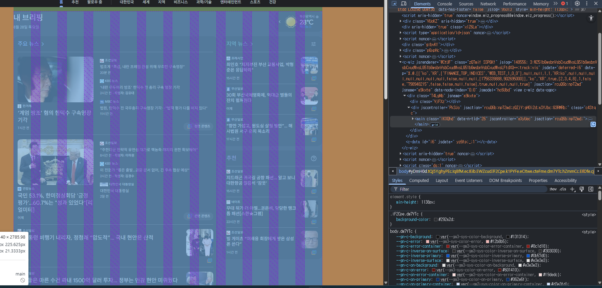

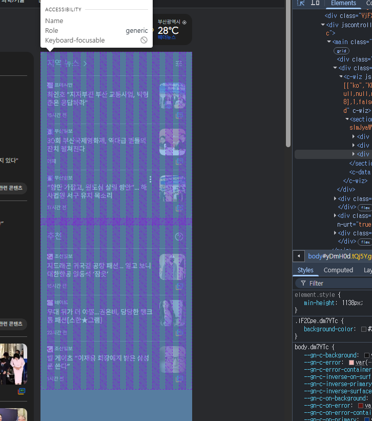

## Grid system 기본요소
1. Container
   1. Column들을 담고 있는 공간

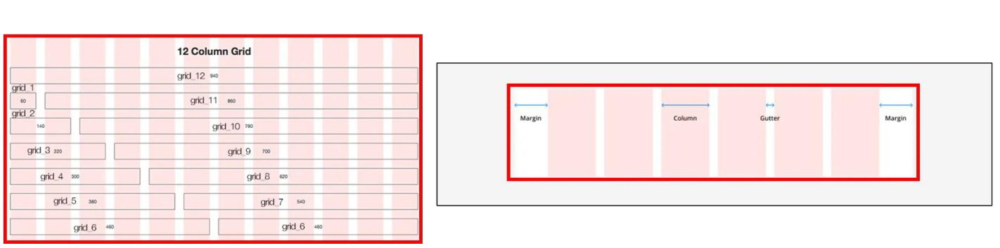

2. Column
   2. 실제컨텐츠를 포함하는 부분

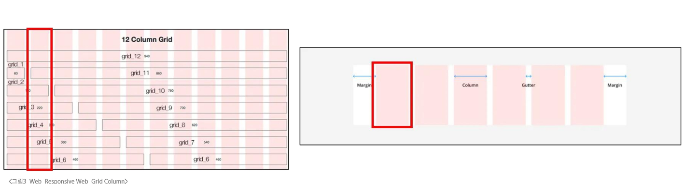

3. Gutter
   3. 컬럼과 컬럼 사이의 여백 영역(상하좌우)

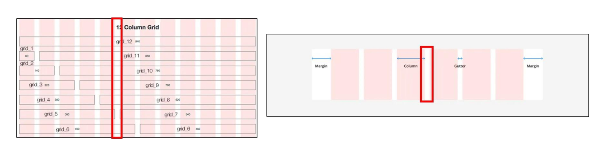

4. 1개의 row 안에 12개의 column 영역이 구성
  4. 각 요소는 12개 중 몇개를 차지할 것인지 지정

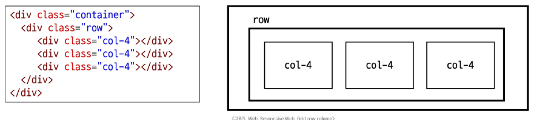

### 예시 - 기본

- before

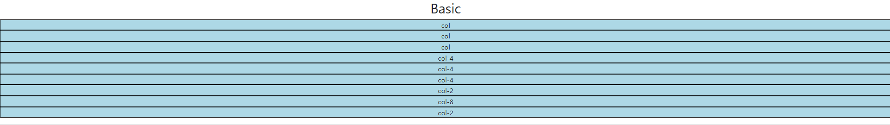


1. 젤 상위 div에 `class="container"`로 설정하면 네이버 처럼 좌우 여백이 생기며 가운데로 모여짐
2. 그 다음 div에 row로 선언하여 행으로 만들겠다고 선언(큰 변화는 없음)
3. 우선 젤 하위 div에 `class="col"`로 설정하면 아래 사진처럼 3칸으로 나뉘어진다
   1. 컬럼의 수를 안줘도 default로 4칸적용 됨을 알 수 있음
```html
  <div class="container">
    <div class="row">
      <div class="col">
        <div class="box">col</div>
      </div>
      <div class="col">
        <div class="box">col</div>
      </div>
      <div class="col">
        <div class="box">col</div>
      </div>
    </div>
```

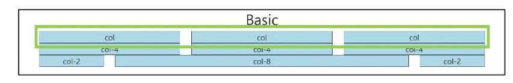

4. 그다음으로 col에 숫자를 넣어 칸을 지정할수있음
   1. 아래 사진처럼 동일하게 3칸이 나뉘어짐
```html
  <div class="container">
    <div class="row">
      <div class="col-4">
        <div class="box">col-4</div>
      </div>
      <div class="col-4">
        <div class="box">col-4</div>
      </div>
      <div class="col-4">
        <div class="box">col-4</div>
      </div>
    </div>
```

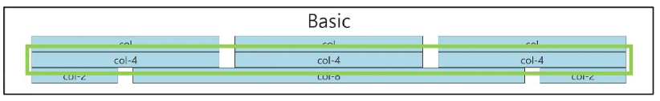

5. 이번엔 숫자를 좀 달리 해서 2 8 2 로 해서 하면 동일하게 한 줄에 12칸을 차지하지만 각자 gutter를 두고 길이는 다른것을 알 수 있음

```html
  <div class="container">
    <div class="row">
      <div class="col-2">
        <div class="box">col-2</div>
      </div>
      <div class="col-8">
        <div class="box">col-8</div>
      </div>
      <div class="col-2">
        <div class="box">col-2</div>
      </div>
    </div>
```

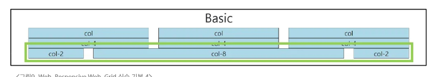

### 예시 - 중첩(Nesting)
- 하나의 column에 또다른 Row넣기

- before

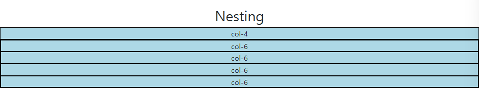

```html
<div class="container">
    <div class="row">
      <div class="col-4 box">
        <div>col-4</div>
      </div>
      <div class="col-8 box">
        <div class="row">
          <div class="col-6">
            <div class="box">col-6</div>
          </div>
          <div class="col-6">
            <div class="box">col-6</div>
          </div>
          <div class="col-6">
            <div class="box">col-6</div>
          </div>
          <div class="col-6">
            <div class="box">col-6</div>
          </div>
        </div>
      </div>
    </div>
  </div>
```

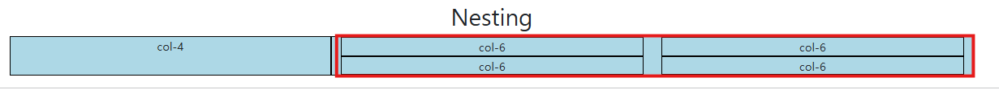

- 위 사진속 네모영역으로 다시 12칸으로 분리한다 
- 즉 2개의 행을 하나의 행으로 해서 4칸짜리 박스옆에 본래는 col-8 영역을 세로운행으로 해서 다시 12칸으로 구분하여 col-6씩 설정한 결과이다.

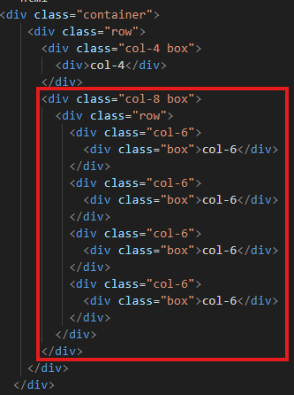

### 예시 - offset
- column 생략하기


- before

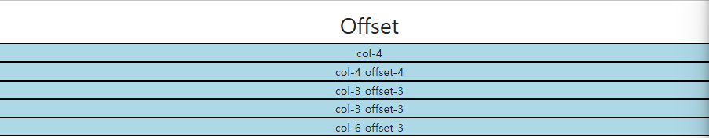

```html
<div class="container">
    <div class="row">
      <div class="col-4">
        <div class="box">col-4</div>
      </div>
      <div class="col-4 offset-4">
        <div class="box">col-4 offset-4</div>
      </div>
    </div>
    <div class="row">
      <div class="col-3 offset-3">
        <div class="box">col-3 offset-3</div>
      </div>
      <div class="col-3 offset-3">
        <div class="box">col-3 offset-3</div>
      </div>
    </div>
    <div class="row">
      <div class="col-6 offset-3">
        <div class="box">col-6 offset-3</div>
      </div>
    </div>
  </div>

```

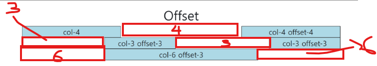

- 여기에서 네모속 숫자만큼 생략이된거임
- 이 역시 생략부분 포함 한 행에 12칸이 넘으면 다음줄로 넘어감

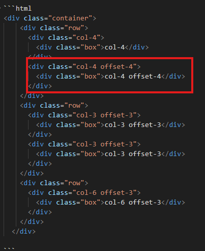

- 만약 사진속 표시부분에 offset을 5를 주면 생략 부분이랑 본래있는 col-4 부분까지 합치면 13이 되기때문에 결국

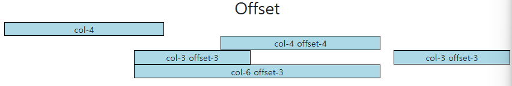

- 이런꼴이난다.


### 예시 - gutters
- Grid system에서 column 사이에 여백 형성
  - x축은 padding, y축은 margin으로 여백 형성

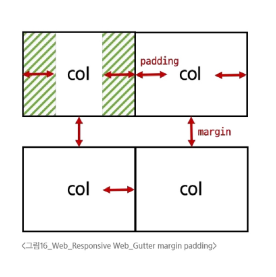

> [!CAUTION]
> 실제 컬럼 간에 좌우 간격(X축)은 변하지 않으며 padding으로 인해 컬럼 안에 contents의 너비가 변함

- before

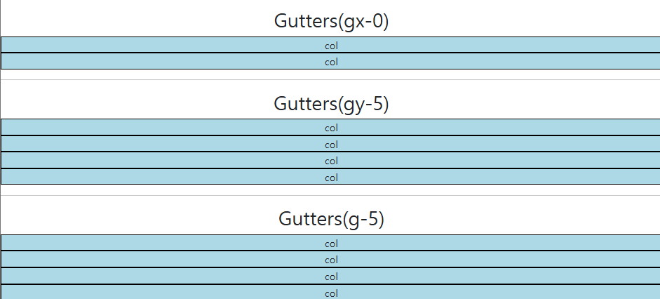

### gutters - `gx-0`

- gx-0을 줌으로써 padding 길이가 0 이됨에 따라 여백이 사라짐

```html
<div class="container">
    <div class="row gx-0">
      <div class="col-6">
        <div class="box">col</div>
      </div>
      <div class="col-6">
        <div class="box">col</div>
      </div>
    </div>
  </div>
```

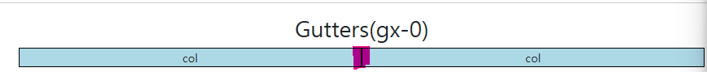

### gutters - `gy-5`

- row 사이 여백 증가

```html
<div class="container">
    <div class="row gy-5">
      <div class="col-6">
        <div class="box">col</div>
      </div>
      <div class="col-6">
        <div class="box">col</div>
      </div>
      <div class="col-6">
        <div class="box">col</div>
      </div>
      <div class="col-6">
        <div class="box">col</div>
      </div>
    </div>
  </div>
```

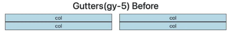


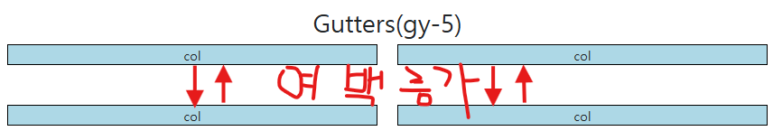


## 1) 두 코드의 차이점

* **`gy-5`**

  * `gutter y-axis`의 줄임말
  * \*\*세로 간격(y축)\*\*만 5단계 여백을 줌
  * 즉, 위아래(col과 col 사이의 수직 간격)에만 공간이 생김

* **`g-5`**

  * `gutter (x+y)`의 줄임말
  * **가로(x축) + 세로(y축)** 전부에 5단계 여백을 줌
  * 즉, 좌우 간격 + 상하 간격이 모두 들어감

👉 따라서 화면에서 보면, `gy-5`는 열(col)들 사이에 좌우 간격은 없이 세로 줄 간격만 넓어지고,
`g-5`는 열 사이 좌우 간격과 세로 줄 간격 모두 넓어집니다.

---

## 2) `g-5` 설명 


### g-5란?

* Bootstrap의 **Gutters(열 간 간격)**을 설정하는 유틸리티 클래스
* `g-숫자` 형태로 사용하며 **가로(x축)와 세로(y축) 간격** 모두 동일하게 적용됨
* 숫자는 간격 크기를 의미하며, 0~5까지 제공됨  
  - `g-0` : 간격 없음  
  - `g-1` : 가장 작은 간격  
  - `g-5` : 가장 큰 간격
* 예시:  
  ```html
  <div class="row g-5">
    <div class="col">col</div>
    <div class="col">col</div>
  </div>
   ```

→ 두 열(col) 사이에 좌우와 상하 모두 넓은 여백이 생김


---

👉 정리하면  
- `gy-5` → y축(세로)만  
- `g-5` → x축(가로) + y축(세로) 둘 다  

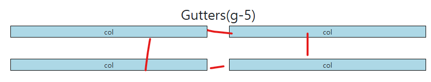