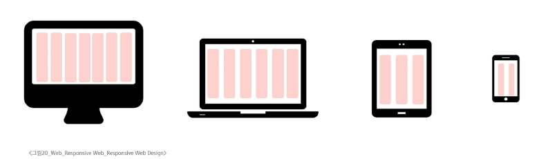
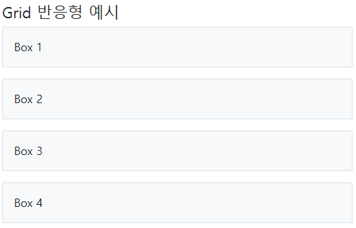
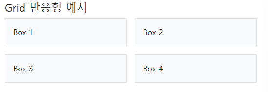
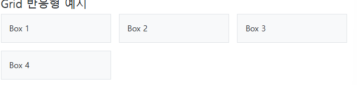
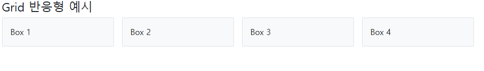

# Grid system Breakpoints

## Responsive Web Design
- 반응형 웹 디자인으로 디바이스 종류나 화면 크기에 상관없이 어디서든 일관된 레이아웃 및 ux 제공 기술

- 12개의 column 속 6개의 **breakpoints**가 있음




## Grid system Breakpoints 이란?

- 웹페이지를 다양한 화면 크기에서 적절하게 배치하기 위한 분기점
  - 화면 너비에 따라 6개의 분기점 제공


| 구분                    | xs `<576px` | sm `≥576px` | md `≥768px` | lg `≥992px` | xl `≥1200px` | xxl `≥1400px` |
| ----------------------- | ----------- | ----------- | ----------- | ----------- | ------------ | ------------- |
| **Container max-width** | None (auto) | 540px       | 720px       | 960px       | 1140px       | 1320px        |
| **Class prefix**        | `.col-`     | `.col-sm-`  | `.col-md-`  | `.col-lg-`  | `.col-xl-`   | `.col-xxl-`   |


## 1) 그리드 반응형 기본 예시

* xs에서는 1열
* sm 이상에서는 2열
* md 이상에서는 3열
* lg 이상에서는 4열

```html
<link rel="stylesheet" href="https://cdn.jsdelivr.net/npm/bootstrap@5.3.3/dist/css/bootstrap.min.css">

<div class="container py-3">
  <h4>Grid 반응형 예시</h4>
  <div class="row g-3">
    <div class="col-12 col-sm-6 col-md-4 col-lg-3"><div class="p-3 bg-light border">Box 1</div></div>
    <div class="col-12 col-sm-6 col-md-4 col-lg-3"><div class="p-3 bg-light border">Box 2</div></div>
    <div class="col-12 col-sm-6 col-md-4 col-lg-3"><div class="p-3 bg-light border">Box 3</div></div>
    <div class="col-12 col-sm-6 col-md-4 col-lg-3"><div class="p-3 bg-light border">Box 4</div></div>
  </div>
</div>
```

- xs



- sm



- md



- lg



---

## 2) 카드 레이아웃 예시

* `row-cols-*` 유틸리티로 **열 개수**를 브레이크포인트별로 제어
* xs 1열  sm 2열  md 3열

```html
<div class="container py-3">
  <h4>Card 반응형 예시</h4>
  <div class="row row-cols-1 row-cols-sm-2 row-cols-md-3 g-3">
    <div class="col">
      <div class="card h-100">
        
        <div class="card-body"><h5 class="card-title">Card 1</h5></div>
      </div>
    </div>
    <div class="col">
      <div class="card h-100">
        
        <div class="card-body"><h5 class="card-title">Card 2</h5></div>
      </div>
    </div>
    <div class="col">
      <div class="card h-100">
        
        <div class="card-body"><h5 class="card-title">Card 3</h5></div>
      </div>
    </div>
  </div>
</div>
```

---

## 3) 표시 전환 예시(display 유틸)

* xs에서는 텍스트 A만 보임
* sm 이상에서는 텍스트 B로 교체

```html
<div class="container py-3">
  <h4>브레이크포인트별 표시 전환</h4>
  <p class="d-sm-none text-primary">xs 전용 내용입니다</p>
  <p class="d-none d-sm-block text-success">sm 이상에서 보이는 내용입니다</p>
</div>
```

---

## 4) 컨테이너 너비 차이 체감

* `.container`는 브레이크포인트마다 **max-width** 적용
* `.container-fluid`는 **항상 100%**

```html
<div class="container py-3 bg-light border">.container 박스입니다</div>
<div class="container-fluid py-3 bg-secondary text-white mt-2">.container-fluid 박스입니다</div>
```
#### 실제 동작은 [여기](/2025.08\code\practice\5weeks\0828\test02.html)에서 live-server 통해 확인하셈