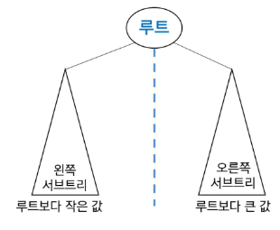
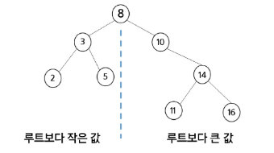
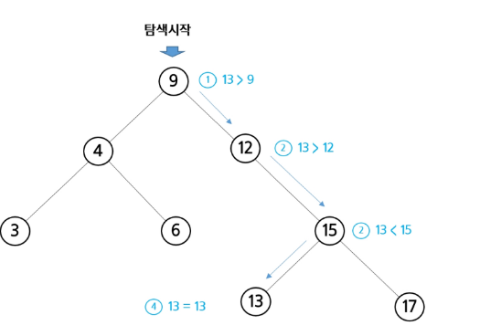
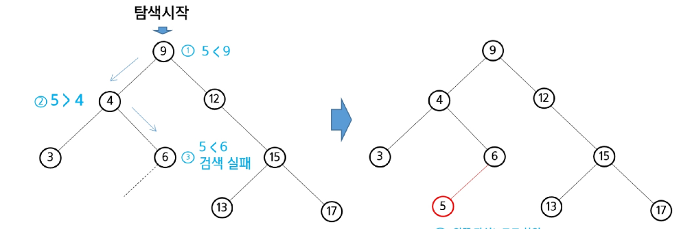
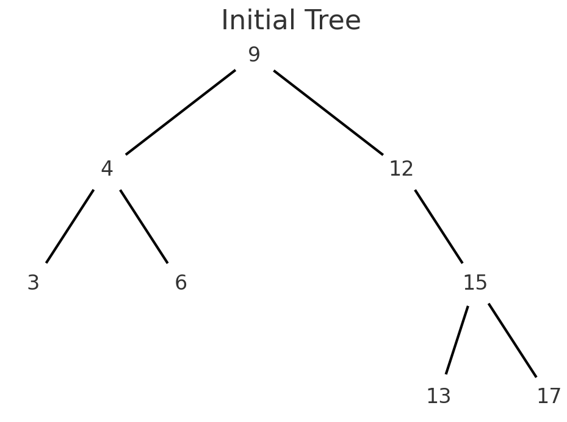
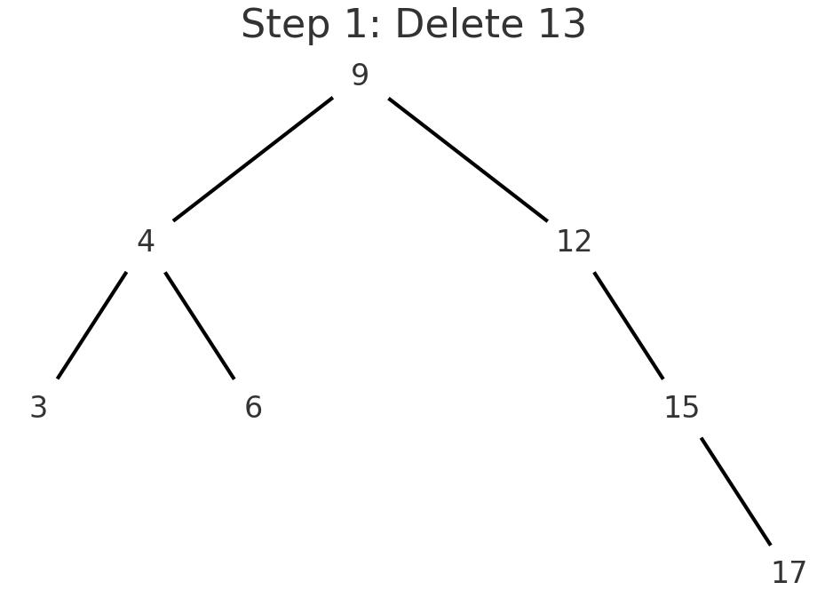
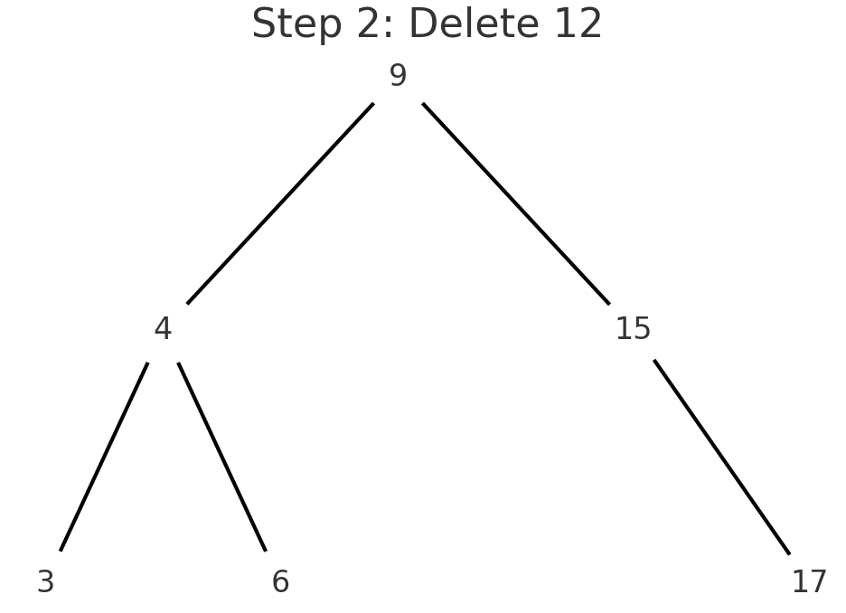
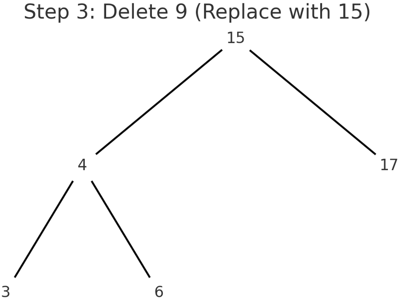

# 이진 탐색 트리(Binary Search Tree - BST)

- data들을 빠르게 검색할 수 있도록 체계적으로 저장을 해 두고 최대 O(log n)의 빠른 속도로 값을 검색할 수 있는 자료구조
- 빠르게 검색될 수 있도록, 특정 규칙을 갖는 이진트리 형태로 값을 저장

## 📌 리스트 vs BST

- **BST**는 리스트보다 더 빠른 삽입 / 삭제 / 탐색이 가능하다.

---

### 📋 리스트 성능

- 삽입 : `O(n)`, 단 맨 끝 삽입은 `O(1)`
- 삭제 : `O(n)`, 단 맨 끝 삭제는 `O(1)`
- 탐색 : `O(n)`

---

### 🌲 BST 성능

- 삽입 : 평균 `O(logN)`
- 삭제 : 평균 `O(logN)`
- 탐색 : 평균 `O(logN)`

## 이진 탐색 트리란?

- 탐색 작업을 효율적으로 하기 위한 자료구조
- 모든 원소는 서로 다른 유일한 키를 갖는다
- key(left_sub)<key(root)<key(right_sub)
- 왼쪽 서브트리와 오른쪽 서브트리도 이진 탐색 트리다
- inorder 하면 오름차순 sorting값 얻을 수 있음





### 탐색연산
- 루트에서 시작
- 탐색할 키 값x를 루트 노드이 키 값과 비교

    - `(키 값 x = 루트노드의 키 값)`인 경우  
    → 원하는 원소를 찾았으므로 탐색 연산 성공
    - `(키 값 x < 루트노드의 키 값)`인 경우  
    → 루트노드의 **왼쪽 서브트리**에 대해서 탐색 연산 수행
    - `(키 값 x > 루트노드의 키 값)`인 경우  
    → 루트노드의 **오른쪽 서브트리**에 대해서 탐색 연산 수행

- 서브트리에 대해서 순환적으로 탐색 연산을 반복한다

### 탐색연산으로 13을 탐색하는 과정


### 삽입연산
1. 먼저 탐색 연산을 수행
  - 삽입할 원소와 같은 원소가 트리에 있으면 삽입 할 수 없으므로 같은 원소가 트리에 있는지 탐색하여 확인
  - 탐색에서 탐색 실패가 결정되는 위치가 삽입 위치가 됨
2. 탐색 실패한 위치에 원소를 삽입
  - 다음 예는 5를 삽입하는 예이다



### 이진 탐색 트리의 성능
- 탐색,삽입,삭제 시간은 트리의 높이만큼 시간이 걸림
  - O(h) : h=BST avg.height
  
- 평균의 경우
  - 이진 트리가 균형적으로 생성되어 있는 경우
  - O(log n)
  
- 최악의 경우
  - 한쪽으로 치우친 경사 이진트리의 경우
  - O(n)
  - 순차탐색과 시간 복잡도가 길다
  


## 📌 이진 탐색 트리의 성능 정리

### 1. 배열에서의 검색 성능

* **순차 검색**: O(N)
* **정렬된 배열 순차 검색**: O(N)
* **정렬된 배열 이진 검색**: O(logN)

  * 단, 삽입·삭제 시 추가 연산 필요 (배열 크기 변경 문제 존재)

---

### 2. 이진 탐색 트리(Binary Search Tree, BST)

* **평균 검색 시간**: O(logN)
* **최악의 경우**: O(N)

  * 트리가 한쪽으로 치우친 경우 (예: 정렬된 데이터 그대로 삽입 시)

#### 개선 방법

* **완전 이진 트리 / 균형 이진 트리(AVL, Red-Black Tree 등)** → 항상 O(logN) 보장
* 삽입 시 트리 균형 유지 → 평균과 최악의 경우가 동일하게 O(logN)

---

### 3. 해시 검색

* **검색 시간**: O(1)
* 단점: 추가 저장 공간 필요, 해시 충돌 처리 필요

---

### 4. 결론 (상황별 검색 알고리즘 선택)

* 데이터가 **정렬 상태 유지 + 삽입/삭제 거의 없음** → **배열 + 이진 검색**
* 데이터가 **삽입/삭제 빈번** → **이진 탐색 트리(특히 균형 트리)**
* 매우 빠른 검색이 필요하고 **메모리 여유 있음** → **해시(Hash Table)**

---

👉 따라서, 상용 서비스에서 **검색 성능을 안정적으로 확보**하려면 **균형 이진 탐색 트리(AVL, Red-Black Tree)** 또는 \*\*해시(Hash Table)\*\*를 가장 많이 사용합니다.


# 📝 이진 탐색 트리 삭제 연산 흐름 정리

## 초기 트리 구조


---

## 1단계: 13 삭제

* **노드 13**은 **단말 노드(leaf node)**
* 삭제 시 그냥 제거하면 됨



---

## 2단계: 12 삭제

* **노드 12**는 **자식이 하나(오른쪽 15)**
* 삭제 시 자식을 부모(9)에 직접 연결



---

## 3단계: 9 삭제

* **노드 9**는 **자식이 둘(왼쪽 4, 오른쪽 15)**
* 삭제 규칙: **중위 순회(Inorder) 후계자(successor)** 또는 \*\*전임자(predecessor)\*\*로 교체

  * 여기서는 successor(오른쪽 서브트리의 최소값 = 15의 왼쪽 자식 없음 → 15)를 선택

1. 9 → 15로 교체
2. 원래 15 노드는 오른쪽 서브트리에서 삭제



---

## ✅ 최종 트리 구조

```
        15
      /    \
     4      17
    / \
   3   6
```

---

## 📌 정리 포인트

1. **단말 노드 삭제** → 바로 제거 (13)
2. **자식이 하나인 노드 삭제** → 자식을 부모에 직접 연결 (12)
3. **자식이 둘인 노드 삭제** → successor(또는 predecessor)로 교체 후 원래 위치에서 제거 (9)


