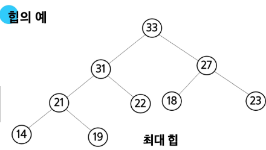
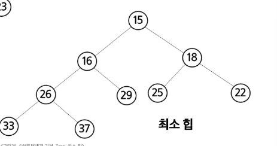
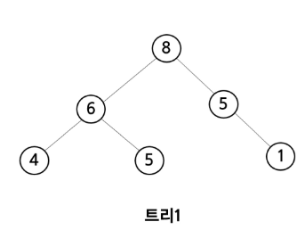
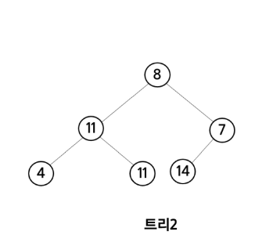
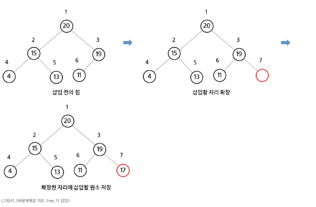
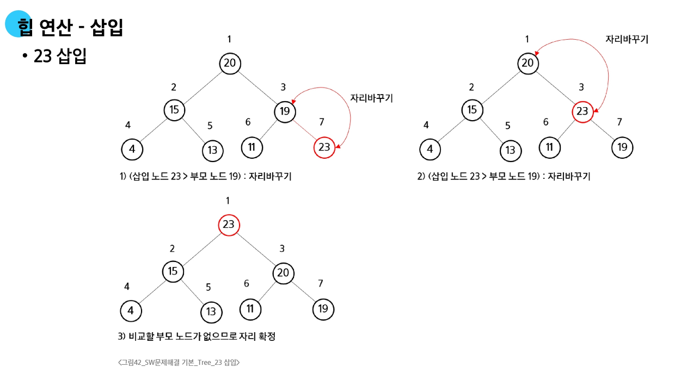
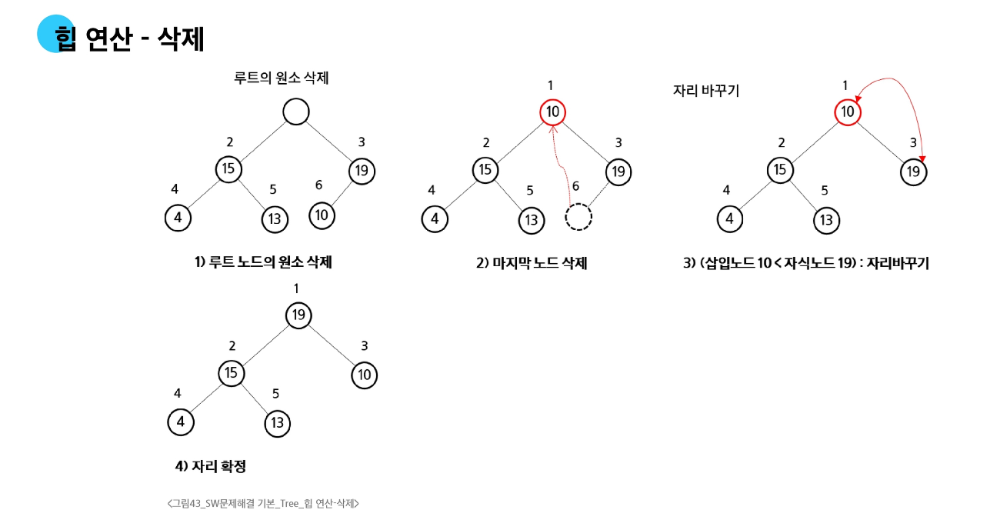

# 📌 Heap(힙) 

## 1. 힙의 개념

* **완전 이진 트리** 기반 자료구조
* **키값이 가장 크거나 작은 노드**를 빠르게 찾기 위해 설계됨

### 종류

* **최대 힙 (Max Heap)**

  * 부모 노드 ≥ 자식 노드
  * 루트 노드 = 최대값
    



* **최소 힙 (Min Heap)**

  * 부모 노드 ≤ 자식 노드
  * 루트 노드 = 최소값
    



## 📌 힙이 아닌 이진 트리의 예

### ✅ 트리1



* 힙 조건(부모 ≥ 자식, Max Heap 가정) 위반

  * 노드 **6의 자식 5**: 부모(6) ≥ 자식(5) → 성립 ✅
  * 노드 **5의 자식 1**: 부모(5) ≥ 자식(1) → 성립 ✅
  * 문제는 **루트 8과 자식 6, 5** 관계 자체는 맞지만,
    → **완전 이진 트리 조건 불만족**

    * 왼쪽 서브트리(6)가 자식 2개(4,5)를 다 채웠는데,
    * 오른쪽 서브트리(5)는 왼쪽 자리가 비어 있고 오른쪽에만 1이 있음
      → **힙은 완전 이진 트리여야 하므로 위반**

---

### ✅ 트리2




* 힙 조건 위반 (Max Heap 기준)

  * 루트 8의 왼쪽 자식이 **11** → 부모(8) < 자식(11) ❌ (힙 성질 위반)
  * 또한 완전 이진 트리 조건도 애매하게 깨짐 (왼쪽 자식 쪽이 과도하게 확장)

---

### 🔎 정리

* **트리1**: 완전 이진 트리 아님 → 힙 불가
* **트리2**: 힙 성질(부모 ≥ 자식) 위반 + 완전 이진 트리 아님 → 힙 불가

---

👉 따라서 **힙이 되려면**

1. **완전 이진 트리** 구조여야 하고
2. **부모 ≥ 자식(Max Heap)** 또는 **부모 ≤ 자식(Min Heap)** 규칙을 만족해야 합니다.

---


## 2. 삽입 연산 (Insertion)

1. 새로운 노드를 **완전 이진 트리의 다음 자리**에 삽입
2. 부모 노드와 비교하여 **힙 속성 위반 시 자리 교환 (sift-up)**
3. 루트까지 올라가며 반복

### 예시

* 삽입 값이 부모보다 크면 (Max Heap 기준) **부모와 교환**
* 이 과정을 반복 → 루트까지 이동 가능




---

## 3. 삭제 연산 (Deletion)

* 힙에서는 **루트 노드만 삭제 가능**
* 과정:

  1. 루트 값을 임시로 저장
  2. 마지막 노드를 루트 자리로 이동
  3. 자식 중 더 큰(또는 작은) 값과 교환하며 **아래로 내려감 (sift-down)**
  4. 힙 속성을 만족하면 중단


---

## 4. 삽입·삭제 예시

* **삽입 예 (23 삽입)**

  * 새 원소 23 삽입 → 부모 19보다 큼 → 자리 교환
  * 부모 20과 비교 → 또 자리 교환
  * 최종적으로 루트가 23이 됨




* **삭제 예 (루트 삭제)**

  * 루트 제거 후 마지막 노드 10을 루트에 배치
  * 자식 19보다 작음 → 교환
  * 최종 루트는 19




---

## 5. 힙의 응용: 우선순위 큐

* **힙을 활용한 우선순위 큐 구현 가능**
* 삽입과 삭제가 모두 O(log N)
* 루트에서 항상 **최대/최소값을 즉시 반환 가능**

### 예

* **최소 힙 (Min Heap)**

  * 루트 = 가장 작은 값
  * 우선순위 큐에서 **가장 우선순위 높은(가장 작은 값)** 원소를 빠르게 찾을 수 있음

```python
import heapq  # 파이썬 내장 최소 힙 라이브러리

# 최소 힙 기반 우선순위 큐
pq = []

# 삽입 (자동으로 최소 힙 정렬됨)
heapq.heappush(pq, 10)
heapq.heappush(pq, 4)
heapq.heappush(pq, 15)
heapq.heappush(pq, 1)
heapq.heappush(pq, 7)

print("현재 힙:", pq)

# 삭제 (항상 가장 작은 값이 나옴)
while pq:
    print("삭제:", heapq.heappop(pq))

```
---

## 📚 핵심 정리

* **힙 = 완전 이진 트리 기반의 특수한 트리**
* **삽입**: 새로운 노드 → 위로 올라가며 교환 (sift-up)
* **삭제**: 루트 제거 → 마지막 노드 대체 후 아래로 교환 (sift-down)
* **시간 복잡도**: 삽입 O(log N), 삭제 O(log N)
* **활용**: 우선순위 큐, 힙 정렬


