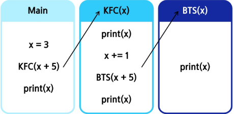

# 반복과 재귀

- 반복과 재귀는 유사한 작업을 수행 가능

- 반복은 수행하는 작업이 완료될 때 까지 게속 반복
    - 루프(for,while 구조)
    - **반복문은 코드를 n번 반복시킬 수 있음**

- 재귀란 주어진 문제의 해를 구하기 위해 동일하면서 더 작은 문제의 해를 이용하는 방법
    - 하나의 큰 문제를 해결할 수 있는 도 작은 문제로 쪼개고 결과들을 결합
    - 재귀호출은 n중 반복문과 같은 효과

### 1,2,3으로 만들 수 있는 두 자릿수 코드

```python

for a in range(1, 4):
    for b in range(1, 4):
        print(a, b)
```

- 이런식으로 2자릿수면 2중으로 돈다
- 만약 자릿수가 9자리일 경우 9중 for문 해야하는데 개 비효율적

### 해결방법

- 재귀호출을 통한 N중 for문 구현
    - N입력후 111~333까지 출력하는 문제는 for문 복잡
    - 아래처럼 재귀호출로 구현 가능

```python
path = []  # 현재까지 선택한 숫자들을 담을 리스트

N = 3  # 목표 깊이


def run(lev):
    # 재귀의 종료 조건(기저조건 : base case) : lev가 N과 같아지면 path 출력
    if lev == N:
        print(*path)
        return
        # 1부터 3까지 숫자를 선택하면서 진행
    for i in range(1, 4):
        path.append(i)  # 현재 숫자 i를 경로에 추가
        run(lev + 4)  # 다음 단계로 내려감(여기서 lev +1 이 아니라 lev+4라 깊이가 점프) 
        path.pop()  # 재귀가 끝나고 돌아오면 직전에 추가한 숫자를 제거(백트레킹)


# __main__
run(0)  # 0부터 시작
```


### 재귀 연습 전 알아야 할 함수 특징 1

- KFC 함수 호출할 때 , int 타입 객체를 전달하면 값만 복사됨
- 아래는 main함수의 x와 KFC함수의 x는 서로 다른 객체


> [!CAUTION]
> **출력 결과는 4가 아니라 3**
> Main함수의 변수x가 BBQ함수의 변수 x로 값만 복사된 것

> [!TIP]
> 만약 4출력하고 싶음 메서드안에 print 작성

### 예시

```python
def KFC(x):
    print(x)  # (2) 전달받은 값 출력
    x += 1  # (3) 지역 변수 x 값 1 증가
    print(x)  # (4) 증가된 값 출력


# __main__
x = 3
KFC(x + 1)  # (1) x 값(3)에 +1 → 4 전달
print(x)  # (5) 메인 영역의 x 그대로 출력
```

---

### 실행 순서

1. `x = 3` 초기화
2. `KFC(x+1)` 호출 → `KFC(4)` 실행
3. `print(x)` → 4 출력 (KFC 내부)
4. `x += 1` → x가 5가 됨 (KFC 내부 지역 변수)
5. `print(x)` → 5 출력 (KFC 내부)
6. `print(x)` → 3 출력 (메인 영역 변수 x 그대로 유지)

---

#### 최종 출력 결과

```
4
5
3
```

---

👉 핵심은 **KFC 내부의 x와 메인 영역의 x는 서로 다른 변수(지역 변수 vs 전역 변수)** 

### 재귀 연습 전 알아야 할 함수 특징 2

- BTS 함수가 끝나면 main으로 되돌아 오는 것이 아니라 **해당 함수를 호출했던 곳으로 돌아옴**



```python
def KFC(x):
    print(x)
    x += 1
    BTS(x + 5)
    print(x)


def BTS(x):
    print(x)


x = 3
KFC(x + 5)
print(x)

'''
8
14
9
3
'''
```


