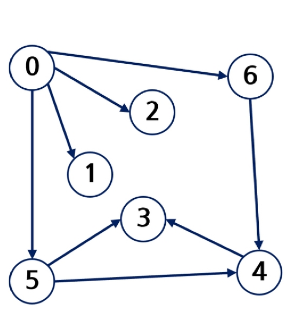
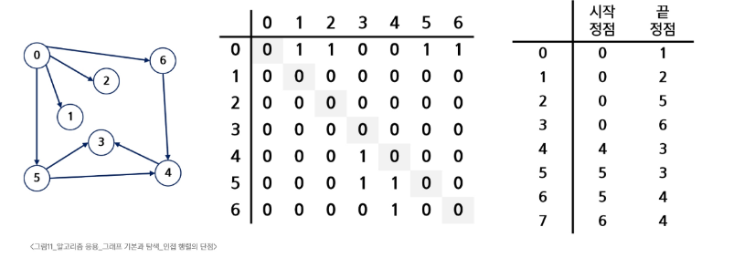

# 그래프 기본

- 아이템(사물 또는 추상적 개념)들과 이들 사이의 연결관계를 표현
> [!TIP]
> 선형 자료구조나 트리 자료구조로 표현하기 어려운 N:N관계를 가지는 원소들을 표현하기에 용이

- 정점들의 집합과 이들을 연결하는 간선드르이 집합으로 구성된 자료구조
    - |V| : 정점의 개수, |E| : 그래프에 포함된 간선의 개수라 할 때 |V|개의 정점을 가지는 그래프는 최대 의 간손을 가질 수 있음
    
- 예 : 5개 정점이 있는 그래프의 최대 간선수는 10(5*4/2)개

## 그래프 유형
1. 무향(무방향)

2. 유향(유방향)

3. 가중치

4. 사이클 없는 방향 그래프

5. 사이클 없는 무향 그래프

6. 완전 그래프

7. 부분 그래프

### 인접정점
- 인접
    - 2개의 정점에 간선이 존재(연결됨)하먄 서로 인접해 있다고함
    - 완전 그래프에 속한 임의의 두 정점들은 모두 인접
    

### 그래프경로

- 경로란 간선들을 순서대로 나열한 것
    - 간선들 : (0,2), (2,4), (4,6)
    - 정점들 : 0 - 2 - 4 - 6
    
- 경로 중 한 정점을 최대한 한번만 지나는 경로를 단순경로라고 함
    - 0 - 2- 4 - 6, 0 - 1 - 6
    
- 시작한 정점에서 끝나는 경로를 사이클 이라고함
    - 1 - 3 - 5 - 1
    
### 그래프표현
- 간선의 정보를 저장하는 방식, 메모리나 성능을 고려해서 결정
- 인접행렬
    - |V| X |V| 크기의 2차원 배열을 이용해서 간선 정보 저장
    
- 인접리스트
    - 각 정점마다 해당 정점과 인접한 정점 정보를 저장
    
- 간선의 배열
    - 간선(시작정점,끝정점)을 배열에 연속적으로 저장
    

### 인접행렬 : 두 정점을 연결하는 간선의 유무를 행렬로 표현

- |V| X |V| 정방행렬
- 행번화와 열 번호는 그래프의 정점에 대응
- 두 정점이 인접되어 있으면 1, 그렇지 않으면 0으로 표현
- 무향 그래프
    - i번째 행의 합 = i번째 열으 합 = vi의 차수
    

---

- 유향그래프
    - 행i의 합 = vi의 진출 차수 
    - 열i의 합 = vi의 진입 차수 

#### 인접 행렬의 단점으론 정점 수에 비해 간선 수가 적은 경우 공간 낭비가 심함

### 인접 리스트
- 각 정점에 대한 인접 정점들을 순차적으로 표현
- 하나의 정점에 대한 인접 정점들을 각각 노드로 하는 연결 리스트로 저장

- 무향 그래프의 인접 리스트

> [!IMPORTANT]
> 무방향 그래프 노드 수 = 간선의 수 * 2
> 각 정점의 노드 수 = 정점의 차수

- 유향 그래프의 인접 리스트

> [!IMPORTANT]
> 방향 그래프 노드 수 = 간선의 수
> 각 정점의 노드 수 = 정점의 진출 차수