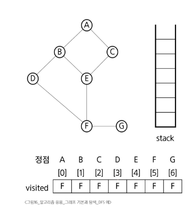

# DFS (Depth First Search, 깊이 우선 탐색)

## 1. DFS (재귀 방식)

* 모든 정점을 중복 없이 빠짐없이 방문하는 경우
* G: 탐색할 그래프
* v: 방문하는 정점

```python
def dfs_recursive(G, v, visited):
    visited[v] = True  # v 방문 설정

    for w in G[v]:     # v와 인접한 정점들 순회
        if not visited[w]:
            dfs_recursive(G, w, visited)

```

---

## 2. DFS (반복 방식)

```python
def dfs_iterative(G, v, visited):
    stack = []
    stack.append(v)

    while stack:
        node = stack.pop()
        if not visited[node]:
            visited[node] = True
            print(node)  # visit(node)

            for w in G[node]:
                if not visited[w]:
                    stack.append(w)

```

---

## 3. DFS 예 (반복)



```python
def dfs_example(G, v, visited):
    stack = []
    stack.append(v)

    while stack:
        node = stack.pop()
        if not visited[node]:
            visited[node] = True
            print(node)  # visit(node)

            for w in G[node]:
                if not visited[w]:
                    stack.append(w)

```

---

## 4. 중복검사가 필요 없는 DFS

* 스택에 push된 정점을 `visited`에 표시함

```python
def dfs_no_duplicate(G, v, visited):
    stack = []
    stack.append(v)
    visited[v] = True

    while stack:
        node = stack.pop()
        print(node)  # visit(node)

        for w in G[node]:
            if not visited[w]:  
                stack.append(w)
                visited[w] = True

```

---

✅ 위 네 가지는 DFS 구현의 대표적인 형태입니다.

* **재귀 방식**: 호출 스택을 활용
* **반복 방식**: 명시적 스택을 직접 사용
* **중복검사 없는 DFS**: push 시점에서 방문 체크하여 중복 pop 방지

