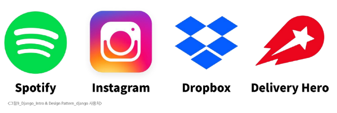

# web Framework

- 웹 에플리케이션을 빠르게 개발할 수 있도록 도와주는 도구
- 개발에 필요한 기본구조,규칙,라이브러리 등을 제공

> 로그인/로그아웃,회원관리,DB,보안 등

## Django Framework

- python 기반 대표 웹 프레임워크
- 클라이언트 - 서버 구조의 서버를 구현하는것이 목적

### 왜 Django를 사용할까?

- **다양성**
  - Python 기반으로 웹, 모바일 앱 백엔드, API 서버 및 빅데이터 관리 등 광범위한 서비스 개발에 적합

- **확장성**
  - 대량의 데이터에 대해 빠르고 유연하게 확장할 수 있는 기능을 제공

- **보안**
  - 취약점으로부터 보호하는 보안 기능이 기본적으로 내장되어 있음

- **커뮤니티 지원**
  - 개발자를 위한 지원, 문서 및 업데이트를 제공하는 활성화 된 커뮤니티

### 검증된 웹 프레임워크

- 대규모 트래프기 서비스에서도 안정적인 서비스 제공

