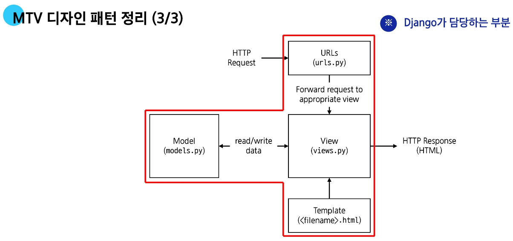

# 🎯 MTV 디자인 패턴 정리



## 1️⃣ Model

* **데이터와 관련된 로직**을 관리
* 응용프로그램의 **데이터 구조**를 정의하고 **데이터베이스 기록**을 관리

📂 위치: `models.py`

---

## 2️⃣ Template

* **레이아웃과 화면**을 처리
* 화면상의 **사용자 인터페이스 구조와 레이아웃**을 정의

📂 위치: `<app>/templates/<app>/*.html`

---

## 3️⃣ View

* Model & Template과 관련된 **로직을 처리하여 응답 반환**
* 클라이언트의 요청에 대해 **처리를 분기**하는 역할

📂 위치: `views.py`

### ✅ View 동작 예시

1. 데이터가 필요하다면 `Model`에 접근하여 데이터를 가져옴
2. 가져온 데이터를 `Template`으로 보내 화면을 구성
3. 구성된 화면을 \*\*응답(HTML)\*\*으로 만들어 클라이언트에 반환

---

## 📌 MTV 흐름도

```mermaid
flowchart LR
    A[HTTP Request] --> B[URLs (urls.py)]
    B --> C[View (views.py)]
    C -->|read/write| D[Model (models.py)]
    D -->|data| C
    C --> E[Template (index.html)]
    E --> F[HTTP Response]
```

---

혹시 제가 이 내용을 **Django의 MVT 패턴**과 **MVC 패턴 비교**까지 확장해서 정리해드릴까요?
