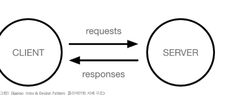
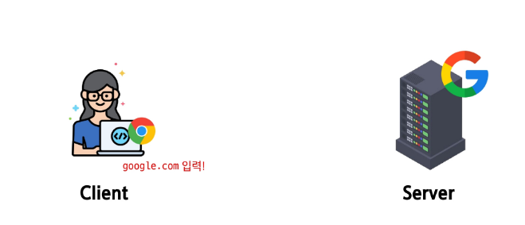
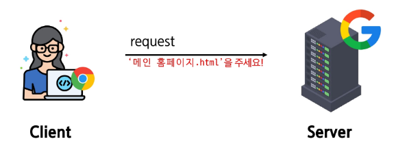
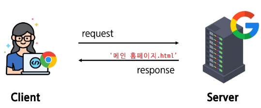
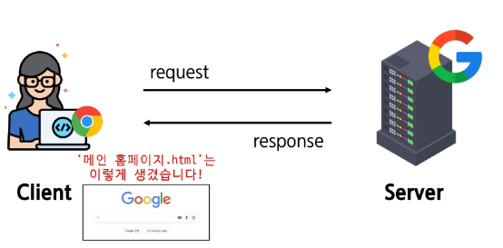

# client&server

- 인터넷을 통해 사용자에게 제공되는 SW 프로그램 구축과정
- 다양한 디바이스에서 웹 브라우저를 통해 접근 및 사용가능

## 클라이언트 - 서버 구조

- 클라이언트 - 서비스를 요청하는 주체
  - 사용하는 웹 브라우저 모바일 앱

- 서버 - 클라이언트의 요청에 응답하는 주체
  - 웹서버,DB서버

> [!TIP]
> 일반적인 웹 서비스에선 클라이언트 페이지를 달라고 `request` 할 경우 서버가 페이지를 `response` 해줌

### 웹페이지 보게 되는 과정

1. 웹 브라우저에서 **'google.com'**을 입력우 엔터

2. 웹 브라우저는 인터넷에 연결된 전 세계 어딘가에 있는 구글 컴퓨터(서버)에서 **`메인 홈페이지.html`** 파일을 달라고 요청

3. 요청을 받은 구글 컴퓨터는 DB에서 **`메인 홈페이지.html`** 파일을 찾아 응답

4. 웹 브라우저는 전달받은 **`메인 홈페이지.html`** 파일을 사람이 볼 수 있도록 해석해주고 사용자는 구글의 메인 페이지를 보게 됨

