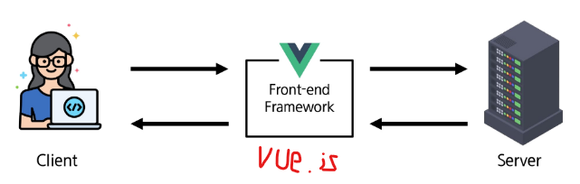
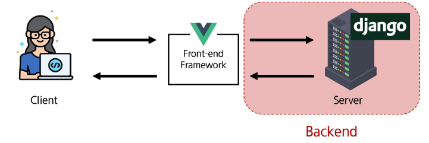

# FrontEnd & BackEnd

- FrontEnd : UI를 구성하고 사용자가 에플리케이션과 상호작용 할 수 있도록 함

> 예 : HTML,CSS,JS 와 같은 프론트엔드 프레임워크

- BackEnd : 서버 측에서 동작하며 클라이언트 요청에 대한 처리와 DB와의 상호작용 등을 담당

> 서버언어(java,python 등) 및 백엔드 프레임워크 ,DB,API 보안 등

## 흐름(FrontEnd)

- Vue.js : 프론트엔드로 활용돠는 대표적인 프레임워크

## 흐름(BackEnd)

