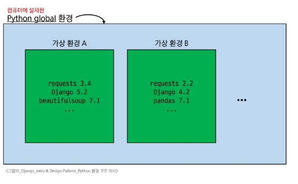

# 가상환경

## 가상 환경이 필요한 시나리오 1

1. 한 개발자가 2개의 프로젝트(A와 B)를 진행해야 하는 상황  
2. 프로젝트 A는 requests 패키지 버전 1이 필요  
3. 프로젝트 B는 requests 패키지 버전 2이 필요  
4. 하지만 파이썬 환경에서 패키지는 1개의 버전만 존재할 수 있음  
5. A와 B의 프로젝트의 다른 패키지 버전 사용을 위한 **독립적인 개발 환경**이 필요  

> **패키지**: 연관된 모듈들을 하나의 디렉토리에 모아놓은 것  

---

## 가상 환경이 필요한 시나리오 2

1. 한 개발자가 2개의 프로젝트(A와 B)를 진행해야 하는 상황  
2. 프로젝트 A는 water라는 패키지가 필요  
3. 프로젝트 B는 fire라는 패키지가 필요  
4. 하지만 파이썬 환경에서 water 패키지와 fire 패키지를 함께 사용하면 충돌이 발생하기 때문에 설치할 수 없다고 함  
5. A와 B의 프로젝트의 패키지 충돌을 피하기 위해 각각 **독립적인 개발 환경**이 필요  

> **패키지**: 연관된 모듈들을 하나의 디렉토리에 모아놓은 것  

---

## python 환경 구조 예시



## 가상 환경 비유

- 같은 집(컴퓨터) 안에, 방(가상 환경)을 따로 만들어 두고,  
- 필요한 물건(라이브러리, 패키지 등)을 그 방에만 들여놓는 것과 유사  
- 방이 다르면 들여놓은 물건이 달라도 서로 간섭하지 않음  

## 가상 환경 생성 및 활성화

## 1. 가상 환경 생성

```bash
python -m venv venv
```

- 현재 디렉토리 안에 `venv` 라는 폴더가 생성됨
- `venv` 폴더 안에는 파이썬 실행 파일, 라이브러리 등을 담을 공간이 마련됨
- `venv` 라는 이름의 가상 환경을 생성한 것
- ※ 임의의 이름으로 생성이 가능하나, 관례적으로 `venv` 이름을 사용

---

## 2. 가상 환경 활성화

```bash
source venv/Scripts/activate
```

- 활성화 후, 프롬프트 앞에 `(venv)`와 같이 표시된다면 성공

※ Mac / Linux에서는 명령어가 다름 주의

```bash
source venv/bin/activate
```

> [!TIP]
>
> - 사용하는 컴퓨터의 OS(Windows, MacOS, Linux 등)에 따라 만들어진 `venv` 폴더의 구조가 다릅니다.
> - 그렇기 때문에 가상 환경을 실행하는 명령어의 구조도 다릅니다!

---

## 3. 가상 환경 종료

```bash
deactivate
```

- 활성화한 상태에서 `deactivate` 명령을 입력하면 다시 Python Global 환경으로 돌아옴
