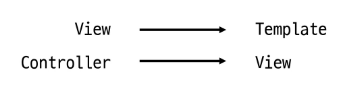

# design pattern

- SW 설계에서 반복적으로 발생하는 문제에 대한 검증되고 재사용 가능한 일반적인 해결책

> [!TIP]
> 에플리케이션 구조는 이렇게 구상하자 라는 모범 답안 또는 관행
> 대표적으로 **`Model View Controller(MVC)`** 패턴이 있음

### MVC 패턴

- 하나의 에플리케이션 구조화하는 대표적인 구조적 디자인 패턴

- Model
  - 데이터 및 비즈니스 로직 처리
- View
  - 사용자에게 보이는 화면을 담당
- Controller
  - 사용자의 입력을 받아 Model과 View를 제어

> 시각적 요소와 뒤에서 실행되는 로직을 서로 영향 없이 독립적이고 쉽게 유지보수 할수있는 에플리케이션을 만들기 위함

## MTV 패턴

- `Model`,**`template`** ,`View` 의 약자로 Django에서 에플리케이션을 구조화하는 디자인 패턴

> 기존 MVC 패턴과 동일하나 단순히 명칭을 다르게 정의한 것
