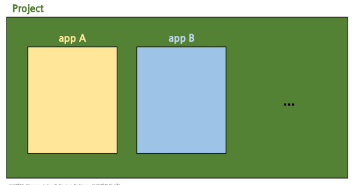
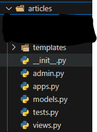
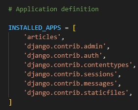

# 프로젝트와 앱

- django에서 프로젝트와 앱의관계



### Django project

- 에플리케이션의 집합
  - DB설정,URL연결,전체 앱 설정 등을 처리

### Django application

- 독립적으로 작동하는 기능 단위 모듈
  - 각자 특정한 기능을 담당
  - 다른 앱들과 함께 하나의 프로젝트를 구성

- 온라인커뮤니티 사이트를 만든다면?
  - 프로젝트 : 카페(전체설정담당)
  - 앱 : 게시글,댓글,회원 관리 등 (DB,인증,화면)

## 앱생성 및 등록

1. 앱 생성

```bash
py manage.py startapp articles # articles은 파일명 
```

- articles라는 폴더 및 내부 여러 파일 생성

> [!WARNING]
> 파일명 즉 앱 이름은 복수형으로 설정 권장



2. 앱 등록

- 반드시 ***`앱을 생성을 한 후 등록`*** 해야 함

- settings.py - 일반적으로 33번 라인에 위치



> [!IMPORTANT]
> 등록을 먼저 할 경우 생성을 위한 명령어 실행 중 아직 존재하지 않는 articles 앱을 찾으려다 실패하기 때문
> 등록 후 생성은 불가!!
