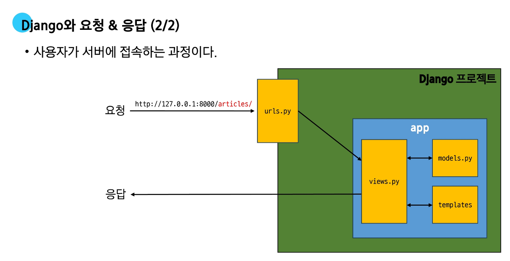
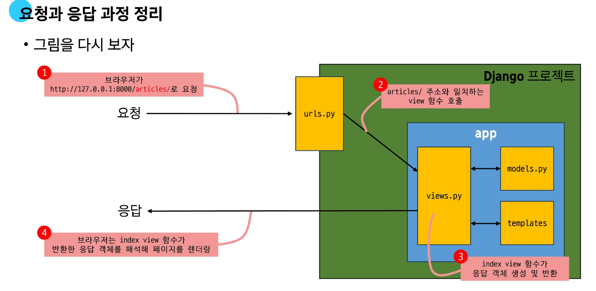

# 요청과 응답


# 📌 Django 데이터 흐름 정리

## 1. URLs

* 사용자가 `http://127.0.0.1:8000/articles/` 로 요청을 보내면 `urls.py` 에 정의된 경로에 따라 해당 view 함수가 호출됨.
* 코드 예시:

```python
# urls.py
from django.contrib import admin
from django.urls import path
from articles import views   # articles 패키지에서 views 모듈 가져오기

urlpatterns = [
    path('admin/', admin.site.urls),
    path('articles/', views.index),   # url 경로는 반드시 '/' 로 끝나야 함
]
```

---

## 2. View

* 요청이 들어왔을 때 실행되는 함수가 정의되는 곳.
* 특정 경로의 template 과 request 객체를 결합해 응답을 반환.
* 코드 예시:

```python
# views.py
from django.shortcuts import render

def index(request):
    return render(request, 'articles/index.html')
```

👉 모든 view 함수는 첫 번째 인자로 요청 객체(`request`)를 반드시 받아야 함.
👉 `request` 이름이 아니어도 되지만 관례적으로 `request` 로 작성.

---

## 3. Template

* 앱 폴더 안에 `templates` 폴더 생성 → 그 안에 `articles` 폴더 생성 → `index.html` 작성.
* 구조:

```
articles/
 └── templates/
      └── articles/
           └── index.html
```

* 예시:

```html
<!-- articles/index.html -->
<!DOCTYPE html>
<html lang="en">
<head>
  <meta charset="UTF-8">
  <title>Document</title>
</head>
<body>
  <h1>Hello, Django!</h1>
</body>
</html>
```

---

## 4. Django Template 인식 규칙

* Django는 기본적으로 `app/templates/` 까지를 경로로 인식.
* 따라서 `views.py` 에서는 `articles/index.html` 형태로 작성해야 함.
* 예시:

```
app폴더 / templates / articles / index.html
```

---

## 5. 응답 페이지 확인

* 서버 실행:

```bash
python manage.py runserver
```

* 브라우저에서 다음 주소 접속:

```
http://127.0.0.1:8000/articles/
```

* 결과:

```
Hello, Django!
```

---

## 6. 데이터 흐름에 따른 코드 작성 순서

* 사용자 요청에서 데이터가 처리되는 흐름은 다음과 같음:

➡️ **URLs → View → Template**

```python
# urls.py
path('articles/', views.index),

# views.py
def index(request):
    return render(request, 'articles/index.html')

# templates/articles/index.html
<h1>Hello, Django!</h1>
```

## Django request & response Architecture




### 과정정리

