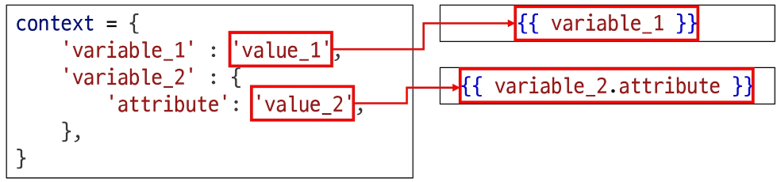

# Django Template Language

- 줄여서 DTL이라고 함 
- 템플릿에서 조건,반복,변수등의 프로그래밍적 기능을 제공하는 시스템

### 1. Variable(변수)

- render 함수의 3번째 인자로 딕셔너리 타입으로 전달
- 해당 딕셔너리 key에 해당하는 문자열이 템플릿에서 사용 가능한 변수명이 됨
- `.`을 사용하여 변수 속성에 접근 가능

```java
{{ variable }}
{{ variable.attribute }}

```



### 2. Filters

- ✅ 개념

* 템플릿에서 **표시할 변수를 수정할 때** 사용
* 사용법: **변수 + `|` + 필터**
* **chained(연결)** 사용 가능 → 여러 개 필터를 연속 적용 가능
* 일부 필터는 \*\*인자(argument)\*\*를 받을 수 있음
* 약 **60여 개의 built-in template filters** 제공

---

- ✅ 기본 문법

```django
{{ variable|filter }}
```

예시:

```django
{{ name|truncatewords:30 }}
```

➡️ `name` 변수를 30단어까지만 표시

---

- ✅ 예시 필터들

| 필터                | 설명                |
| ----------------- | ----------------- |
| `lower`           | 문자열을 소문자로 변환      |
| `upper`           | 문자열을 대문자로 변환      |
| `length`          | 리스트/문자열의 길이 반환    |
| `truncatewords:n` | n개의 단어까지만 출력 후 생략 |
| `date:"Y-m-d"`    | 날짜를 지정된 형식으로 출력   |

## 3. Tags

- 반복 또는 논리를 수행하여 제어 흐름을 만듦
- 일부 태그는 시작과 종료 태그 필요

- 쉽게 말해 파이썬에 if 문으로 조건에 따라 다르게 출력하는 방식도 있고
- for 문을 통해 데이터의 개수가 2개이상일경우 데이터 개수에 맞춰 출력을 보장해줌


### ✅ if, else, endif 태그

```django
context = {
    'login': False,
}
```

- 템플릿 코드:

```django

  <h1>Hello, User!!!</h1>

  <h1>Please, login.</h1>

```

- 출력 결과:

```html
<h1>Please, login.</h1>
```

---

### ✅ for 태그

```java
context = {
    'nums': [1, 2, 3],
}
```

템플릿 코드:

```java
<ul>
  
    <li>{{ num }}</li>
  
</ul>
```

출력 결과:

```html
<ul>
  <li>1</li>
  <li>2</li>
  <li>3</li>
</ul>
```

---

#### 📌 정리

* `if/else/endif` → 조건 분기 처리
* `for` → 리스트/쿼리셋 등 반복 처리
* Django 템플릿에서는 파이썬 문법 대신 **템플릿 태그**(``)를 사용해야 함
