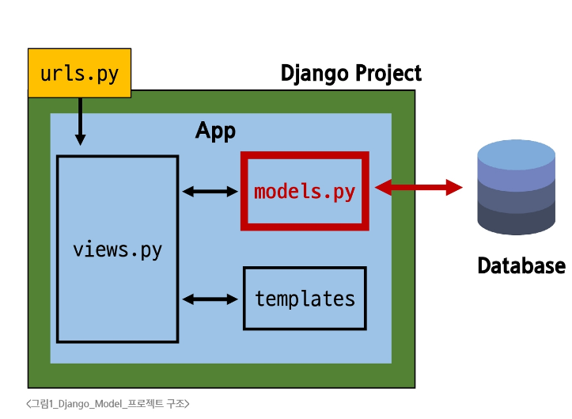

# Model Class & Field

## Model?

- DB와 파이썬클래스(객체)로 추상화된 형태로 상호작용

> [!NOTE]
> - Django의 강력한 기능 : 개발자가 DB에 대한 깊은 지식 없이도 쉽게 데이터 관리 가능
> - 유지보수 및 확장성 증대 : DB변경 시에도 코드 수정 최소화, 재사용 가능한 데이터 모델을 통해 개발 효율성 향상

### Model을 통한 DB관리

- urls.py : 사용자 요청의 시작점
- views.py : 요청을 처리하고 models.py 를 통해 데이터를 다룸
- **`models.py`** : DB를 정의하고, DB와 상호작용
- templates : views.py로부터 받은 데이터를 사용자에게 보여줄 화면을 구성



## Model Class
- DB의 테이블을 정의하고 데이터를 조작할 수 있는 기능들을 제공
- 쉽게말해 SQL 쿼리 없이 CRUD 기능을 다 할수있게 하는 미친 프레임워크임

### 기본적인 Model class

```py
from django.db import models

class Article(models.Model):  # extends class Model
    ############ 문자열 필드##############
    # charfield 파라미터값은 varchar(10) 같은거임
    title = models.CharField(max_length=10)
    content = models.TextField(null=True)  # 무한대는 아니며 사용하는 시스템에 따라 달라짐

```

> [!WARNING]
> 앱 안에 `models.py`에서 위 로직을 작성해야됨