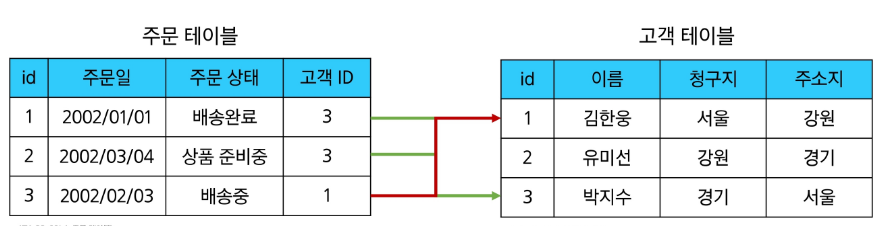
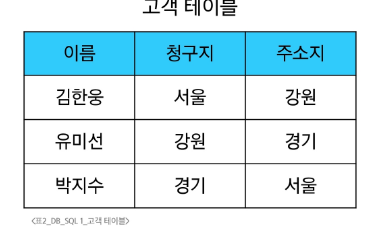
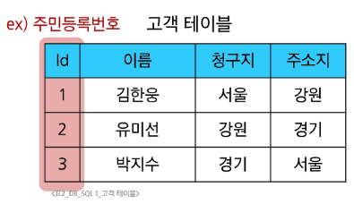
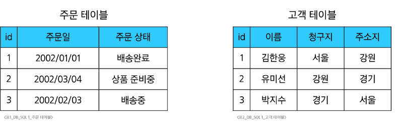
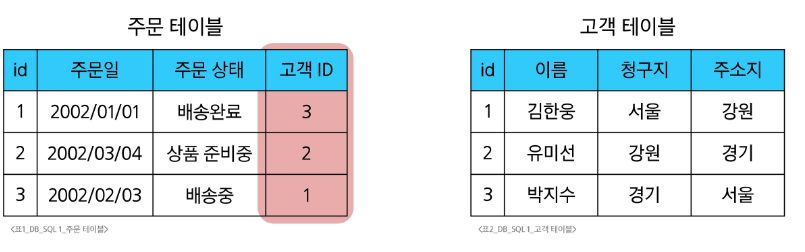
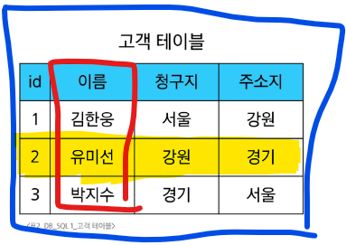

# 2.Relational Database

### DB의 역할은 데이터를 저장(구조적 저장)하고 조작(CRUD)
```txt
데이터 간에 관계가 있는 데이터 항목들의 모음
```
- 테이블,행 열의 정보를 구조화하는 방식
- **서로 관련된 데이터 포인터를 저장** 하고  이에 대한 **엑세스**를 제공



### 여기에서 말하는 관계란?
- 여러 테이블 간의 (논리적) 연결

> [!NOTE]
> 데이터를 각각의 테이브렝 나눠 저장하되 공통된 키값을 통해 서로 연결하여 필요할 떄 함께 조회하거나 조작할 수 있도록 합니다.


## 관계로 할 수 있는것
- 이 관계로 인해 두 테이블을 사용하여 데이터를 다양한 형식으로 조회가능
  - 특정 날짜에 구매한 모든 고객 조회
  - 지난 달에 배송일이 지연된 고객정보등

### 관계형 DB 예시 - 1
- 다음과 같이 고객 데이터가 테이블에 저장되어 있다고 가정
- 고객 데이터 간 비교를 위해서는 어떤 값을 활용?




### 관계형 DB 예시 - 2

- 정답 : 각 데이터에 고유한 식별 값 부여(PK)


### 관계형 DB 예시 - 3

- 다음과 같이 주문 데이터가 테이블에 저장되어 있다고 가정
- 누가 어떤 주문을 헀는지 식별 방법?




### 관계형 DB 예시 - 4

- 정답 : 고객테이블의 PK를 참고해서 저장(FK)



## 관계형 데이터베이스 관련 키워드



### <span style="color:blue">1. Table (aka Relation)</span>

* 데이터를 기록하는 곳

---

### <span style="color:red">2. Field (aka Column, Attribute)</span>

* 각 필드에는 고유한 데이터 형식(타입)이 지정됨

---

### <span style="color:gold">3. Record (aka Row, Tuple)</span>

* 각 레코드에는 구체적인 데이터 값이 저장됨


---


## DBMS?
- Database Management System
- 즉, 데이터베이스를 관리하는 소프트웨어 시스템
> [!NOTE]
> **DBMS(Database Management System)**는 컴퓨터 안에서
‘정리된 서류함 역할’을 합니다. 데이터를 일정한 규칙으로 저장하고,필요할 때 쉽게 꺼내거나 바꿀 수 있도록 도와주는 도구.

### 역할

- 데이터 저장 및 관리를 용이하게 하는 시스템
- DB와 사용자 간의 인터페이스 역할
- 사용자가 데이터 구성, 업데이트, 모니터링, 백업,복구 등을 할수 있도록 도움

## RDBMS
- Relational Database Management System
- 관계형 DB관리 SW 시스템

>[!NOTE]
> 도서관의 대출 시스템을 떠올려 봅시다.
> 책은 도서 목록, 사람은 회원 명단,
> 대출 내역은 대출 기록이라는 표로 관리된다고 할게요.
> 이 세 표는 각각 따로 있지만,
> 회원 번호와 책 번호를 통해 서로 연결되어 있습니다.

> [!IMPORTANT]
> ➡️ **RDBMS(Relational DBMS)**는 이런 식으로 데이터를 여러 **테이블(table)**에 나누어 저장하고, 공통된 **키(key)**를 통해 서로 ‘관계’를 맺어
함께 사용할 수 있게 해주는 시스템입니다. 