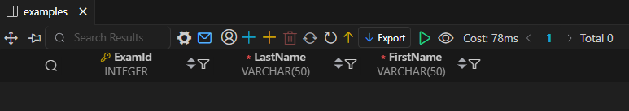
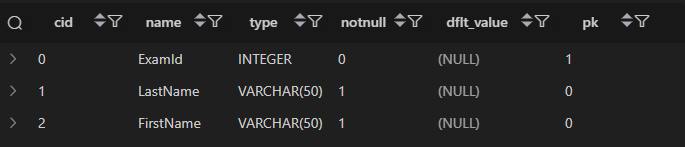
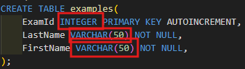
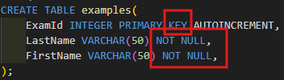
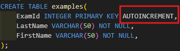
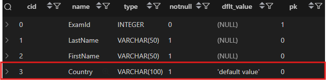
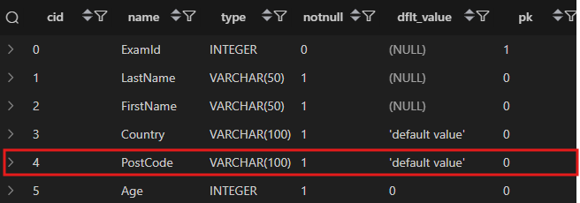
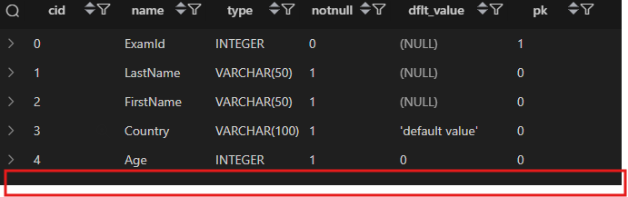
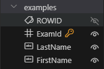
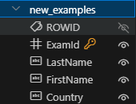

# 1. Managing tables

## SQL Statements 유형

| **유형**                                                                              | **역할**                               | **SQL 키워드**                                                                                                                                                                |
| ------------------------------------------------------------------------------------- | -------------------------------------- | ----------------------------------------------------------------------------------------------------------------------------------------------------------------------------- |
| **<span style="color:red; font-weight:bold;">DDL</span>**  (Data Definition Language) | 데이터의 기본 구조 및 형식 변경        | **<span style="color:red; font-weight:bold;">CREATE</span>, <span style="color:red; font-weight:bold;">DROP</span>, <span style="color:red; font-weight:bold;">ALTER</span>** |
| **DQL** (Data Query Language)                                                         | 데이터 검색                            | **SELECT**                                                                                                                                                                    |
| **DML** (Data Manipulation Language)                                                  | 데이터 조작 (추가, 수정, 삭제)         | **INSERT, UPDATE, DELETE**                                                                                                                                                    |
| **DCL** (Data Control Language)                                                       | 데이터 및 작업에 대한 사용자 권한 제어 | **COMMIT, ROLLBACK, GRANT, REVOKE**                                                                                                                                           |


## Create a table

### CREATE TABLE Syntax

```sql
CREATE TABLE table_name(
    column_1 data_type constraints,
    column_2 data_type constraints,
    ...,
);
```

- 각 필드에 적용할 **데이터 타입** 작성
- 테이블 및 필드에 대한 **제약조건(constraints)** 작성
### 활용

```sql
CREATE TABLE examples(
    ExamId INTEGER PRIMARY KEY AUTOINCREMENT,
    LastName VARCHAR(50) NOT NULL,
    FirstName VARCHAR(50) NOT NULL,
);
```



## PRAGMA
- 테이블 스키마 확인
  
```sql
PRAGMA table_info('examples');
```



### 구성 - 1
- 데이터 타입


### 구성 - 2
- 제약 조건


### 구성 - 2
- `AUTOINCREMENT` 키워드



### SQLite 데이터 타입

| 데이터 타입 | 설명                                      |
| ----------- | ----------------------------------------- |
| **NULL**    | 아무런 값도 포함하지 않음을 나타냄        |
| **INTEGER** | 정수                                      |
| **REAL**    | 부동 소수점                               |
| **TEXT**    | 문자열                                    |
| **BLOB**    | 이미지, 동영상, 문서 등의 바이너리 데이터 |


## 제약 조건 (constraints)
- 테이블의 필드에 적용되는 규칙 또는 제한 사항

> [!NOTE]
> 데이터의 무결성을 유지하고 DB의 일관성을 보장

### 대표적인 3가지

- `PRIMARY KEY`
  - 해단 필드를 기본 키로 지정
> [!WARNING]
> INTEGER 타입에만 적용되며 INT,BIGINT 등과 같은 다른 정수 유형은 적용되지 않음

- `NOT NULL`
  - 해당 필드에 NULL 값을 허용하지 않도록 지정
- `FOREIGN KEY`
  - 다른 테이블과으 외래 키 관계를 정의

### AUTOINCREMENT 특징

* **필드의 자동 증가를 나타내는 특수한 키워드**
* 주로 **primary key** 필드에 적용
* **INTEGER PRIMARY KEY AUTOINCREMENT**가 작성된 필드는 항상 새로운 레코드에 대해 이전 최대 값보다 큰 값을 할당
* 삭제된 값은 무시되며 재사용할 수 없음

> [!NOTE]
> **AUTOINCREMENT keyword**
> 자동으로 고유한 정수 값을 생성하고 할당하는 필드 속성


--- 


## ALTER TABLE

| **명령어**                                                      | **역할**    |
| ------------------------------------------------------------ | --------- |
| **ALTER TABLE** <span style="color:red">ADD COLUMN</span>    | 필드 추가     |
| **ALTER TABLE** <span style="color:red">RENAME COLUMN</span> | 필드 이름 변경  |
| **ALTER TABLE** <span style="color:red">DROP COLUMN</span>   | 필드 삭제     |
| **ALTER TABLE** <span style="color:red">RENAME TO</span>     | 테이블 이름 변경 |


## 1. ALTER TABLE ADD COLUMN syntax

```sql
ALTER TABLE table_name
ADD COLUMN column_definition
```

- `ADD COLUMN` 키워드 이후 추가하고자 하는 새 필드 이름과 데이터 타입 및 제약 조건 설정

> [!WARNING]
> 단, 추가하고자 하는 필드에 `NOT NULL` 제약 조건이 있을경우 NULL이 아닌 기본 값 설정 필요


### 활용

- examples 테이블에 다음 조건에 맞는 Country 컬럼 추가



- **테이블 생성 시 정의한 필드는 기본 값이 없어도 NOT NULL 제약조건으로 생성됨**
- **내부적으로 Default Value는 NULL 로 설정됨**

### 직접 활용 - 1 

```sql
ALTER TABLE examples
ADD COLUMN Country VARCHAR(100) NOT NULL DEFAULT 'default value';
```

> [!IMPORTANT]
> CREATE TABLE 시에는 컬럼을 처음 만들 때 기본값을 지정하지 않아도, 자동으로 컬럼에 값을 추가할 수 있기 때문에 DEFAULT를 생략할 수 있지만, **ALTER TABLE**로 컬럼을 추가할 경우 기존 레코드에 값을 채워야 하기 때문에 기본값을 지정하는 것이 일반적

### 직접 활용 - 2 
- examples 테이블에 다음 조건에 맞는 Age,Address 컬럼 추가
```sql
ALTER Table examples 
add COLUMN Address VARCHAR(100) NOT NULL DEFAULT 'default value';

ALTER Table examples 
add COLUMN Age INTEGER NOT NULL DEFAULT 0;
```

> [!DANGER]
> SQLite는 단일 문을 사용하여 한번에 여러 필드 추가 ***불가능!!***


## 2. ALTER TABLE RENAME COLUMN syntax


```sql
ALTER TABLE table_name
RENAME COLUMN current_name TO new_name;
```

- `RENAME COLUMN` 키워드 뒤에 이름을 바꾸려는 필드의 이름을 지정하고 TO 키워드 뒤에 새로운 이름을 지정

### 직접 활용
- exampels 테이블에 Address 컬럼 이름을 PostCode로 변경



```sql
ALTER TABLE exampels
RENAME COLUMN Address TO PostCode;
```

이미지에서 제공된 내용을 **마크다운(Markdown)** 형식으로 변환하여 아래와 같이 작성하였습니다.

---

## 3. ALTER TABLE DROP COLUMN syntax

```sql
ALTER TABLE
    table_name
DROP COLUMN
    column_name;
```

* **DROP COLUMN** 키워드 뒤에 삭제할 필드 이름 지정

---

## ALTER TABLE DROP COLUMN 활용

* **examples** 테이블의 **PostCode** 필드를 삭제:



```sql
ALTER TABLE examples
DROP COLUMN PostCode;
```

> ✨ **주의**: 쿼리 실행 후 **`PRAGMA table_info('examples');`**를 통해 결과를 확인가능.

---

## 4. ALTER TABLE RENAME TO syntax

```sql
ALTER TABLE
    table_name
RENAME TO
    new_table_name;
```

* **RENAME TO** 키워드 뒤에 새로운 테이블 이름 지정

 <br> 
---

## ALTER TABLE RENAME TO 활용

* **examples** 테이블 이름을 **new_examples**로 변경:

```sql
ALTER TABLE examples
RENAME TO new_examples;
```

---

## 5. DROP TABLE syntax

```sql
DROP TABLE table_name;
```

* **DROP TABLE** statement 이후 삭제할 테이블 이름 작성

---

## DROP TABLE 활용

* **new_examples** 테이블 삭제:

```sql
DROP TABLE new_examples;
```


