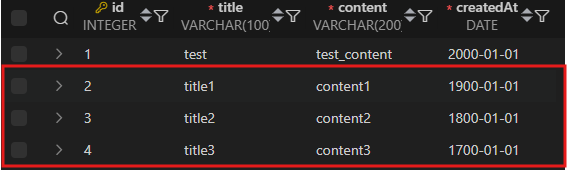
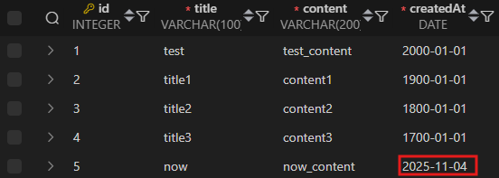
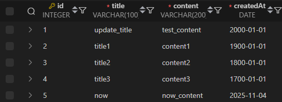
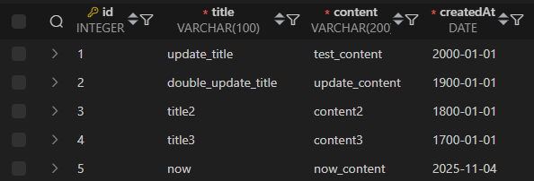
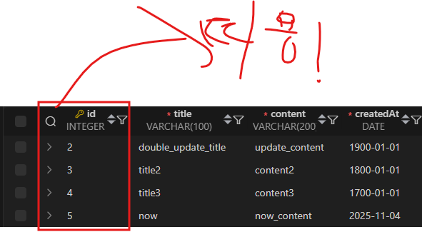
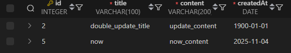

# 2. Modifying Data
    | **유형**                                                            | **역할**                               | **SQL 키워드**                                                    |
    | ------------------------------------------------------------------- | -------------------------------------- | ----------------------------------------------------------------- |
    | **DDL** (Data Definition Language)                                  | 데이터의 기본 구조 및 형식 변경        | **CREATE**, **DROP**, **ALTER**                                   |
    | **DQL** (Data Query Language)                                       | 데이터 검색                            | **SELECT**                                                        |
    | <span style="color:red">**DML**</span> (Data Manipulation Language) | 데이터 조작 (추가, 수정, 삭제)         | <span style="color:red">**INSERT**, **UPDATE**, **DELETE**</span> |
    | **DCL** (Data Control Language)                                     | 데이터 및 작업에 대한 사용자 권한 제어 | **COMMIT**, **ROLLBACK**, **GRANT**, **REVOKE**                   |


## INSERT syntax

```sql
INSERT INTO table_name (column_1,column_2,...)
VALUES (value_1,value_2,...);
```

- `INSERT INTO` 절 다음에 테이블 이름과 괄호 안에 필드 목록 작성
- `VALUES` 키워드 다음 괄호 안에 해당 필드에 삽입할 값 목록 작성

### 활용 1


```sql
INSERT INTO articles(title,content,createdAt)
VALUES('test','test_content','2000-01-01');
```

### 활용 2
- 여러개의 데이터를 삽입하고 싶을때



```sql

INSERT INTO 
    articles (title, content, createdAt)
VALUES 
    ('title1', 'content1', '1900-01-01'),
    ('title2', 'content2', '1800-01-01'),
    ('title3', 'content3', '1700-01-01');

```

### 활용 3

- `DATE()` 빌트인 함수를 이용해 현재 날짜를 자동적으로 입력



```sql
INSERT INTO articles(title,content,createdAt)
VALUES('now','now_content',DATE());
```

## UPDATE syntax

```sql
UPDATE table_name
SET column_name = update_name
WHERE condition
```

- `SET` 절 다음에 수정할 필드와 새 값을 지정
- `WHERE` 절에서 수정할 레코드를 지정하는 조건 작성
> [!WARNING]
> `WHERE`절 작성을 안 할시 해당 컬럼에 모든 내용이 `SET` 키워드 뒤에 내용으로 변경되니 유의할 것
> 또한 `WHERE`절 뒤에는 기존 내용을 작성하면 되는데 기존내용 중 변경을 희망하는 PK값을 적는게 더욱 정확


### 활용 1
- 단일 컬럼 내용 수정시



```sql
UPDATE articles
SET title = 'update_title'
WHERE id=1;
```

### 활용 2
- 여러 컬럼 내용 수정시



```sql

UPDATE articles
SET 
title = 'double_update_title',
content = 'update_content'
WHERE id=2;
```

## DELETE syntax

```sql
DELETE FROM table_name
WHERE condition
```

- `UPDATE`문과 마찬가지로 삭제를 희망하는 pk값 등을 지정해서 실행하면됨
- ***단, `WHERE`절을 생략 할 경우 모든 레코드가 사라지니 유의할 것!!!***


### 활용 1

- 단일 컬럼 삭제 시 (여기에선 pk 1번 컬럼을 삭제)



```sql
DELETE FROM articles
WHERE id=1;
```

## 활용 2
- 여러개의 컬럼 삭제 시 - 작성일이 오래된 순으로 정렬하여 2개만 삭제



```sql
DELETE FROM articles
WHERE id IN(
    SELECT id FROM articles
    ORDER BY "createdAt"
    LIMIT 2
);
```

이 쿼리문은 **`articles`** 테이블에서 **`id`가 가장 오래된 2개의 레코드**를 삭제하는 쿼리입니다.

### 서브쿼리:

1. **`DELETE FROM articles`**

   * `articles` 테이블에서 데이터를 삭제하려고 합니다.

2. **`WHERE id IN (...)`**

   * 삭제할 레코드를 **`id` 값으로 지정**합니다. 이 `id` 값은 서브쿼리로 조회한 값입니다.

3. **서브쿼리:**

   ```sql
   SELECT id FROM articles
   ORDER BY "createdAt"
   LIMIT 2
   ```

   * **`SELECT id`**는 **`articles`** 테이블에서 `id` 값을 조회합니다.
   * **`ORDER BY "createdAt"`**은 `createdAt`(생성 날짜)을 기준으로 오름차순 정렬하여 **가장 오래된 레코드**부터 출력됩니다.
   * **`LIMIT 2`**는 **두 개의 레코드**만 선택하여 삭제합니다.

### 최종적으로 이 쿼리는 **`articles` 테이블에서 가장 오래된 두 개의 레코드를 삭제**합니다.
