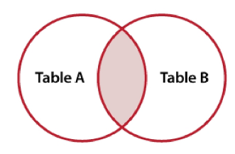
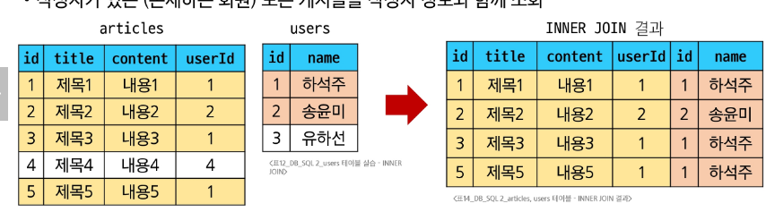
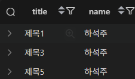
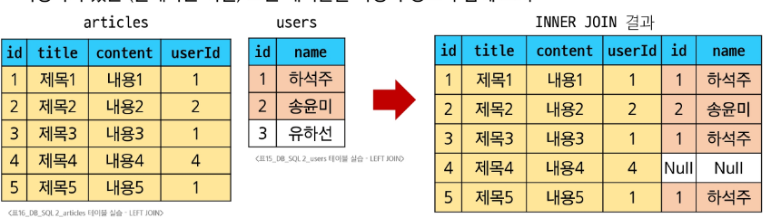

# 3. Multi table queries

## JOIN

## 관계의 필요성 (1/4)

* 커뮤니티 게시판에 필요한 데이터 생각해보기

| id | title | content | writer | role                                     |
| -- | ----- | ------- | ------ | ---------------------------------------- |
| 1  | 제목1   | 내용1     | 하석주    | <span style="color:orange;">admin</span> |
| 2  | 제목2   | 내용2     | 송윤미    | student                                  |
| 3  | 제목3   | 내용3     | 유하선    | student                                  |

---

## 관계의 필요성 (2/4)

* **'하석주'** 가 작성한 모든 게시글을 조회하기

```sql
SELECT * FROM 테이블 WHERE writer = '하석주';
```

| id | title | content | writer | role                                     |
| -- | ----- | ------- | ------ | ---------------------------------------- |
| 1  | 제목1   | 내용1     | 하석주    | <span style="color:orange;">admin</span> |
| 4  | 제목4   | 내용4     | 하석주    | <span style="color:orange;">admin</span> |

---

## 관계의 필요성 (3/4)

* 테이블을 나누어서 분류하기

| id | title | content | userId |
| -- | ----- | ------- | ------ |
| 1  | 제목1   | 내용1     | 1      |
| 2  | 제목2   | 내용2     | 1      |
| 3  | 제목3   | 내용3     | 3      |

| id | name | roleId |
| -- | ---- | ------ |
| 1  | 하석주  | 1      |
| 2  | 송윤미  | 3      |
| 3  | 유하선  | 2      |

| id | role    |
| -- | ------- |
| 1  | admin   |
| 2  | staff   |
| 3  | student |

---

## 관계의 필요성 (4/4)

* **articles**와 **users** 테이블에 각각 `userId`, `roleId` 외래 키 필드 작성

| id | title | content | userId                               |
| -- | ----- | ------- | ------------------------------------ |
| 1  | 제목1   | 내용1     | <span style="color:yellow;">1</span> |
| 2  | 제목2   | 내용2     | <span style="color:yellow;">1</span> |
| 3  | 제목3   | 내용3     | 3                                    |

| id | name | roleId                               |
| -- | ---- | ------------------------------------ |
| 1  | 하석주  | <span style="color:yellow;">1</span> |
| 2  | 송윤미  | 3                                    |
| 3  | 유하선  | 2                                    |

---

* **관리자인 사람만 보고싶다면?** → `roleId`가 1인 데이터 조회
* **하석주라는 사람이 권미숙으로 개명한다면?** → `users`에서 한 번만 변경하면 자동으로 모두 변경

## JOIN이 필요한 순간
- 테이블을 분리하면 데이터 관리는 용이 하지만 출력엔 문제가 발생
- 테이블 한 개 만을 출력할 수 밖에 없에 다른 테이블과 결합하여 출력하는 것이 필요해짐 

> [!TIP]
> 테이블을 나누는이유? 
> 중복을 줄이고 수정,삭제가 쉬워지도록 하기 위해
> 하지만 화면에는?
> 사용자 이름과 주문 내용을 함께 보여줘야 하는 상황이 많음
> 이럴 땐 테이블을 다시 묶어야 하는 방법이 **`JOIN`!!**


## INNER JOIN syntax



```sql
SELECT select_list
FROM table_a
INNER JOIN table_b
ON table_b.fk = table_a.pk;
```

- `FROM`절 이후 메인 테이블 지정(table_a)
- `INNER JOIN` 절 이후 메인 테이블과 조인할 테이블을 지정(table_b)
- `ON`키워드 이후 JOIN 조건을 작성
- JOIN 조건은 table_a,table_b 간의 컬럼을 일치시키는 규칙을 지정

## 예시

- 작성자가 있는(존재하는 회원) 모든 게시글 작성자 정보와 함께 조회



```sql
SELECT * FROM articles
INNER JOIN users
ON users.id = articles.userId;
```

### 활용

- 1반회원(하석주)이 작성한 모든 게시글의 제목과 작성자명을 조회



```sql
SELECT articles.title, users.name  -- 출력할 컬럼을 각각 테이블.컬럼명 형식으로 선택
FROM articles                     -- 데이터를 가져올 첫 번째 테이블(articles)을 지정
INNER JOIN users                  -- 두 번째 테이블(users)와 결합 (기본적으로 INNER JOIN)
ON users.id = articles.userId     -- 두 테이블을 연결하는 조건 (users 테이블의 id와 articles 테이블의 userId가 일치하는 경우)
WHERE users.id = 1;                -- 조건을 설정하여 userId가 1(하석주)인 데이터만 선택

```

이해했습니다! **LEFT JOIN**에 대한 마크다운을 **간단히 설명**과 함께 작성해드리겠습니다.

---

## LEFT JOIN

### **LEFT JOIN Syntax**

```sql
SELECT select_list
FROM table_a
LEFT JOIN table_b
ON table_b.fk = table_a.pk;
```

* **`FROM`**: 첫 번째 테이블을 지정합니다 (table_a).
* **`LEFT JOIN`**: 두 번째 테이블을 **왼쪽 테이블 기준**으로 조인합니다 (table_b).
* **`ON`**: 조인할 때 사용할 조건을 작성합니다. (`table_b.fk = table_a.pk`).

### **LEFT JOIN 설명**

* **`LEFT JOIN`**은 **왼쪽 테이블**에 있는 모든 레코드를 **오른쪽 테이블**의 일치하는 레코드와 결합합니다.
* **왼쪽 테이블**에 있는 레코드는 모두 포함되고, **오른쪽 테이블**에 매칭되는 값이 없으면 **`NULL`**을 반환합니다.

---

## LEFT JOIN 예시 (1/2)

### **모든 게시글을 작성자 정보와 함께 조회하기**


```sql
SELECT articles.title, users.name
FROM articles
LEFT JOIN users
ON articles.userId = users.id;
```

* **결과**: `articles` 테이블에 있는 모든 게시글에 대해 **작성자 정보를 추가**로 가져옵니다.
* 만약 게시글에 작성자가 없다면, **`NULL`** 값으로 표시됩니다.

---

## LEFT JOIN 예시 (2/2)

### **작성자가 있는 모든 게시글을 작성자 정보와 함께 조회하기**


```sql
SELECT * FROM articles
LEFT JOIN users
ON articles.userId = users.id
WHERE users.id IS NOT NULL;
```

* **결과**: 작성자가 **존재하는** 게시글만 **조회**합니다.
  이때 **`users.id IS NOT NULL`** 조건을 사용하여 **작성자 정보가 있는 데이터만** 가져옵니다.

---

## LEFT JOIN 특징

* **왼쪽 테이블의 모든 레코드**를 표시합니다.
* **오른쪽 테이블**과 연결된 값이 없으면 **`NULL`**로 표시됩니다.

### **TIP**

* **LEFT JOIN**은 **왼쪽 테이블** 기준으로 모든 레코드를 보여줍니다.
* **오른쪽 테이블**에 연결된 값이 없으면 **`NULL`**로 표시되어, 특정 값이 없는 경우 **누락된 데이터를 확인**하는 데 유용합니다.

---

## LEFT JOIN 활용 1

### **게시글을 작성한 이력이 없는 회원 정보 조회하기**


```sql
SELECT users.name
FROM users
LEFT JOIN articles
ON articles.userId = users.id
WHERE articles.userId IS NULL;
```

* **결과**: 게시글을 작성한 이력이 없는 **회원만 조회**합니다.

---

이와 같이 **LEFT JOIN**을 활용하면, **기존 데이터와 연관된 데이터를 찾거나 누락된 데이터를 확인**할 때 유용하게 사용할 수 있습니다.
