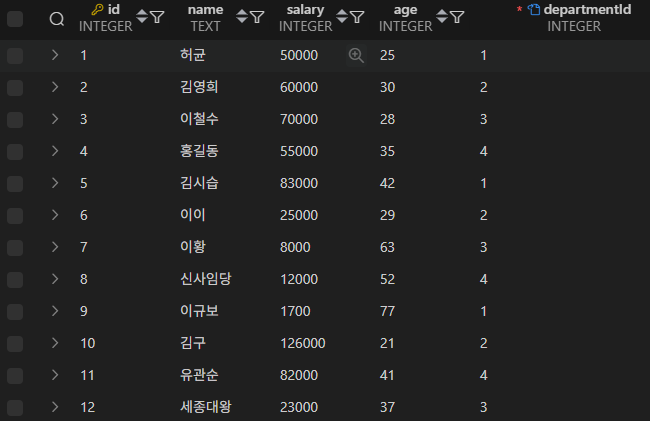
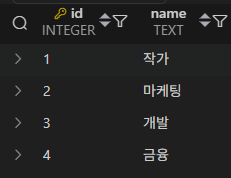

# 🧾 SQL 실습 정리: 부서별 통계 및 그룹함수 응용

## 📘 실습 목표

* **부서별 직원 데이터**를 기반으로

  * 최고 연령자 및 평균 연령 조회
  * 최고 급여자 조회
  * 연령대별 직원 수 구분
  * 최고 급여자 제외 평균 급여 계산
* **GROUP BY**, **JOIN**, **서브쿼리**, **집계함수** 등을 종합적으로 연습한다.
### DEFAULT DATASET



<br>



---

## 1️⃣ 부서별 최고 연령자 및 평균 연령 조회

### 🧩 설명

* 각 부서(`departmentId`)별로

  * **최고 나이(`MAX(age)`)**,
  * **평균 나이(`AVG(age)`)**를 계산하고
  * 해당 최고 나이 직원의 이름(`name`)을 표시한다.

### 🧠 쿼리

```sql
SELECT
    d.name AS department,
    e.name AS oldest_employee,
    t.max_age,
    t.avg_age
FROM (
        SELECT
            departmentId,
            MAX(age) AS max_age,
            AVG(age) AS avg_age
        FROM employees
        GROUP BY departmentId
    ) AS t
JOIN employees e 
    ON e.departmentId = t.departmentId 
   AND e.age = t.max_age
JOIN departments d 
    ON d.id = t.departmentId
ORDER BY d.name;
```

### ✅ 결과 예시

| department | oldest_employee | max_age | avg_age |
| ---------- | --------------- | ------- | ------- |
| 개발         | 이황              | 63      | 42.67   |
| 금융         | 신사임당            | 52      | 42.67   |
| 마케팅        | 김영희             | 30      | 26.67   |
| 작가         | 이규보             | 77      | 48.00   |

---

## 2️⃣ 부서별 최고 급여자 조회

### 🧩 설명

* 각 부서별로 **가장 많은 급여를 받는 직원**과
  해당 직원의 **급여 금액**을 함께 조회한다.

### 🧠 쿼리

```sql
SELECT
    d.name AS department,
    e.name AS top_employee,
    e.salary AS top_salary
FROM employees e
JOIN departments d 
    ON d.id = e.departmentId
WHERE e.salary = (
        SELECT MAX(e2.salary)
        FROM employees e2
        WHERE e2.departmentId = e.departmentId
    )
ORDER BY d.name, e.name;
```

### ✅ 결과 예시

| department | top_employee | top_salary |
| ---------- | ------------ | ---------- |
| 개발         | 김시습          | 83000      |
| 금융         | 김구           | 126000     |
| 마케팅        | 김영희          | 60000      |
| 작가         | 홍길동          | 55000      |

> 💡 **동률일 경우** 동일 급여자의 모든 행이 표시된다.

---

## 3️⃣ 부서별 연령대별 직원 수 조회

### 🧩 설명

* 나이 구간을

  * **Under 30**
  * **BETWEEN 30–40**
  * **Over 40**
    으로 나누어 부서별 직원 수를 집계한다.

### 🧠 쿼리

```sql
SELECT
  d.name AS department,
  CASE
    WHEN e.age < 30 THEN 'Under 30'
    WHEN e.age BETWEEN 30 AND 40 THEN 'BETWEEN 30-40'
    ELSE 'Over 40'
  END AS age_group,
  COUNT(*) AS num_employees
FROM employees e
JOIN departments d 
  ON d.id = e.departmentId
GROUP BY d.name, age_group
ORDER BY d.name,
  CASE 
    WHEN age_group = 'Under 30' THEN 1
    WHEN age_group = 'BETWEEN 30-40' THEN 2
    ELSE 3
  END;
```

### ✅ 결과 예시

| department | age_group     | num_employees |
| ---------- | ------------- | ------------- |
| 개발         | Under 30      | 1             |
| 개발         | BETWEEN 30–40 | 1             |
| 개발         | Over 40       | 1             |
| 금융         | BETWEEN 30–40 | 1             |
| 금융         | Over 40       | 2             |
| 마케팅        | Under 30      | 2             |
| 마케팅        | BETWEEN 30–40 | 1             |
| 작가         | Under 30      | 1             |
| 작가         | Over 40       | 2             |

---

## 4️⃣ 부서별 최고 급여자를 제외한 평균 급여 조회

### 🧩 설명

* 각 부서의 **최대 급여를 구한 후**,
  그 금액을 제외한 직원들의 **평균 급여**를 계산한다.

### 🧠 쿼리

```sql
SELECT
    d.name AS department,
    AVG(e.salary) AS avg_salary_excl_top
FROM employees e
JOIN departments d 
    ON d.id = e.departmentId
JOIN (
        SELECT departmentId, MAX(salary) AS max_salary
        FROM employees
        GROUP BY departmentId
    ) m ON m.departmentId = e.departmentId
WHERE e.salary < m.max_salary
GROUP BY d.name
ORDER BY d.name;
```

### ✅ 결과 예시

| department | avg_salary_excl_top |
| ---------- | ------------------- |
| 개발         | 25833.33            |
| 금융         | 47000.00            |
| 마케팅        | 45000.00            |
| 작가         | 38500.00            |

> 💡 모든 직원의 급여가 동일한 경우, 평균은 `NULL` 로 표시된다.

---

## 📊 요약 정리

| 구분              | 사용 문법                                | 핵심 함수/키워드       | 설명 |
| --------------- | ------------------------------------ | --------------- | -- |
| **최고 연령자 조회**   | `GROUP BY`, `JOIN`, `MAX()`, `AVG()` | 부서별 최고·평균 나이    |    |
| **최고 급여자 조회**   | `WHERE = (SELECT MAX(...))`          | 서브쿼리로 최고 급여자 찾기 |    |
| **연령대별 직원 수**   | `CASE WHEN`, `COUNT()`, `GROUP BY`   | 조건별 그룹핑         |    |
| **최고 급여 제외 평균** | `JOIN`, `AVG()`, `WHERE < MAX()`     | 최대 급여자 제외 평균 급여 |    |

---

## 🧩 추가 연습 아이디어

* 최고 연령자와 최고 급여자가 **동일인인지** 확인하는 쿼리 작성
* `HAVING` 절을 이용하여 평균 급여가 일정 금액 이상인 부서만 조회
* `ROUND()` 함수를 사용해 소수점 이하 반올림 표시
